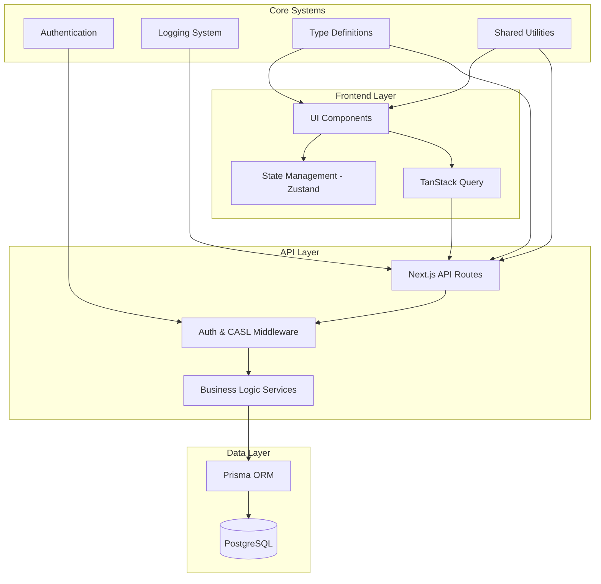

# Design Document

## Overview

Dự án cần được refactor để cải thiện architecture, performance, maintainability và developer experience. Design này tập trung vào việc tạo ra một codebase nhất quán, type-safe và dễ maintain với các patterns rõ ràng cho API layer, state management, component architecture và database operations.

## Architecture

### High-Level Architecture



### Module Structure

```
src/
├── core/                    # Core system modules
│   ├── api/                # API client & utilities
│   ├── auth/               # Authentication & authorization
│   ├── state/              # State management utilities
│   ├── types/              # Shared type definitions
│   └── utils/              # Shared utilities
├── features/               # Feature-based modules
│   ├── users/
│   │   ├── api/           # API layer for users
│   │   ├── components/    # UI components
│   │   ├── hooks/         # TanStack Query hooks
│   │   ├── state/         # Zustand state
│   │   └── types/         # Feature-specific types
│   └── lessons/
├── shared/                 # Shared components & utilities
│   ├── components/        # Reusable UI components
│   ├── hooks/             # Reusable hooks
│   └── utils/             # Feature-agnostic utilities
└── app/                   # Next.js app directory
    ├── api/               # API routes
    └── (pages)/           # Page components
```

## Components and Interfaces

### 1. Enhanced API Layer

#### API Client Architecture

```typescript
// Enhanced API client with interceptors and type safety
interface ApiClientConfig {
  baseURL?: string;
  timeout?: number;
  retries?: number;
  interceptors?: {
    request?: RequestInterceptor[];
    response?: ResponseInterceptor[];
    error?: ErrorInterceptor[];
  };
}

interface ApiResponse<T> {
  data: T;
  success: boolean;
  message?: string;
  meta?: PaginationMeta;
}

interface ApiError {
  message: string;
  status: number;
  code?: string;
  details?: Record<string, unknown>;
}
```

#### Standardized API Route Pattern

```typescript
// Standard API route structure
interface RouteHandler<TRequest, TResponse> {
  auth: AuthConfig;
  validation: ValidationSchema<TRequest>;
  handler: (
    request: TypedRequest<TRequest>,
    context: RequestContext
  ) => Promise<ApiResponse<TResponse>>;
}

interface RequestContext {
  user: AuthenticatedUser;
  tenant: Tenant;
  logger: Logger;
  db: PrismaClient;
}
```

### 2. Optimized State Management

#### Store Factory Pattern

```typescript
interface StoreConfig<T> {
  name: string;
  persist?: boolean;
  devtools?: boolean;
  middleware?: Middleware[];
}

interface StoreSlice<T> {
  state: T;
  actions: Record<string, Function>;
  selectors: Record<string, Selector<T, any>>;
}
```

#### Selector Optimization Pattern

```typescript
// Optimized selector patterns to prevent infinite loops
interface SelectorHooks<T> {
  // Individual selectors for single values
  useField: <K extends keyof T>(field: K) => T[K];

  // Tuple selectors for multiple values with shallow comparison
  useFields: <K extends keyof T>(fields: K[]) => Pick<T, K>;

  // Action selectors separated from data selectors
  useActions: () => StoreActions<T>;
}
```

### 3. Component Architecture Patterns

#### Feature Component Structure

```typescript
interface FeatureComponentProps {
  // Props interface
}

interface FeatureComponentState {
  // Local state interface
}

// Separation of concerns pattern
const FeatureComponent = () => {
  // 1. Data fetching (TanStack Query)
  const query = useQuery(buildFeatureQuery());

  // 2. UI state (Zustand)
  const uiState = useFeatureUI();

  // 3. Business logic (custom hooks)
  const actions = useFeatureActions();

  // 4. Render logic
  return <FeatureView {...props} />;
};
```

#### Reusable Component Library

```typescript
// Standardized component interfaces
interface BaseComponentProps {
  className?: string;
  testId?: string;
  loading?: boolean;
  error?: string | null;
}

interface FormComponentProps<T> extends BaseComponentProps {
  data: T;
  onSubmit: (data: T) => void;
  validation?: ValidationSchema<T>;
}

interface ListComponentProps<T> extends BaseComponentProps {
  items: T[];
  onSelect?: (item: T) => void;
  renderItem: (item: T) => ReactNode;
  pagination?: PaginationProps;
}
```

### 4. Type Safety Improvements

#### Strict Type Definitions

```typescript
// Replace all 'any' types with proper interfaces
interface DatabaseEntity {
  id: string;
  createdAt: Date;
  updatedAt: Date;
  tenantId?: string;
}

interface ApiEntity<T = Record<string, unknown>> extends DatabaseEntity {
  data: T;
  meta?: EntityMeta;
}

// Utility types for better type inference
type StrictOmit<T, K extends keyof T> = Omit<T, K>;
type RequiredFields<T, K extends keyof T> = T & Required<Pick<T, K>>;
type PartialFields<T, K extends keyof T> = Omit<T, K> & Partial<Pick<T, K>>;
```

#### Query Key Type Safety

```typescript
// Type-safe query key factory
interface QueryKeyFactory {
  users: {
    all: () => readonly ["users"];
    list: (
      params?: UserListParams
    ) => readonly ["users", "list", UserListParams?];
    detail: (id: string) => readonly ["users", "detail", { id: string }];
  };
  lessons: {
    all: () => readonly ["lessons"];
    list: (
      params?: LessonListParams
    ) => readonly ["lessons", "list", LessonListParams?];
    detail: (id: string) => readonly ["lessons", "detail", { id: string }];
  };
}
```

## Data Models

### Enhanced Entity Interfaces

```typescript
// User entity with proper typing
interface User extends DatabaseEntity {
  name: string;
  email: string;
  role: UserRole;
  isActive: boolean;
  lastLoginAt?: Date;
  preferences?: UserPreferences;
}

interface UserPreferences {
  theme: "light" | "dark";
  language: string;
  notifications: NotificationSettings;
}

// Lesson entity with relationships
interface Lesson extends DatabaseEntity {
  title: string;
  description?: string;
  order: number;
  status: ContentStatus;
  unitId: string;
  courseId: string;

  // Computed fields
  _count?: {
    stories: number;
    vocabularies: number;
    quizzes: number;
  };
}
```

### API Request/Response Types

```typescript
// Standardized request/response patterns
interface ListRequest {
  search?: string;
  page?: number;
  pageSize?: number;
  sortBy?: string;
  sortOrder?: "asc" | "desc";
  filters?: Record<string, unknown>;
}

interface ListResponse<T> {
  data: T[];
  meta: {
    total: number;
    page: number;
    pageSize: number;
    totalPages: number;
    hasNext: boolean;
    hasPrev: boolean;
  };
}

interface CreateRequest<T> {
  data: Omit<T, "id" | "createdAt" | "updatedAt">;
}

interface UpdateRequest<T> {
  id: string;
  data: Partial<Omit<T, "id" | "createdAt" | "updatedAt">>;
}
```

## Error Handling

### Comprehensive Error System

```typescript
// Error hierarchy
abstract class BaseError extends Error {
  abstract readonly code: string;
  abstract readonly statusCode: number;

  constructor(
    message: string,
    public readonly context?: Record<string, unknown>
  ) {
    super(message);
    this.name = this.constructor.name;
  }
}

class ValidationError extends BaseError {
  readonly code = "VALIDATION_ERROR";
  readonly statusCode = 400;

  constructor(
    message: string,
    public readonly field?: string,
    public readonly value?: unknown
  ) {
    super(message);
  }
}

class AuthenticationError extends BaseError {
  readonly code = "AUTHENTICATION_ERROR";
  readonly statusCode = 401;
}

class AuthorizationError extends BaseError {
  readonly code = "AUTHORIZATION_ERROR";
  readonly statusCode = 403;
}

class NotFoundError extends BaseError {
  readonly code = "NOT_FOUND";
  readonly statusCode = 404;
}

class DatabaseError extends BaseError {
  readonly code = "DATABASE_ERROR";
  readonly statusCode = 500;
}
```

### Error Boundary and Recovery

```typescript
interface ErrorBoundaryState {
  hasError: boolean;
  error?: Error;
  errorInfo?: ErrorInfo;
}

interface ErrorRecoveryStrategy {
  canRecover: (error: Error) => boolean;
  recover: (error: Error) => void;
}

// Global error handler with recovery strategies
const errorRecoveryStrategies: ErrorRecoveryStrategy[] = [
  {
    canRecover: (error) => error instanceof NetworkError,
    recover: (error) => {
      // Retry network requests
      queryClient.refetchQueries();
    },
  },
  {
    canRecover: (error) => error instanceof AuthenticationError,
    recover: (error) => {
      // Redirect to login
      router.push("/login");
    },
  },
];
```

## Testing Strategy

### Testing Architecture

```typescript
// Test utilities and mocks
interface TestContext {
  user: MockUser;
  tenant: MockTenant;
  db: MockDatabase;
  queryClient: QueryClient;
}

interface MockApiResponse<T> {
  data: T;
  status: number;
  headers: Record<string, string>;
}

// Component testing utilities
const renderWithProviders = (
  component: ReactElement,
  options?: {
    user?: MockUser;
    initialState?: Partial<AppState>;
    queryClient?: QueryClient;
  }
) => {
  // Setup providers and render
};

// API testing utilities
const mockApiCall = <T>(endpoint: string, response: MockApiResponse<T>) => {
  // Mock API responses
};
```

### Test Categories

1. **Unit Tests**: Individual functions, hooks, and components
2. **Integration Tests**: Feature workflows and API interactions
3. **E2E Tests**: Complete user journeys
4. **Performance Tests**: Bundle size, render performance, query performance

## Performance Optimizations

### Bundle Optimization

```typescript
// Code splitting strategy
const LazyAdminPanel = lazy(() => import("./AdminPanel"));
const LazyUserDashboard = lazy(() => import("./UserDashboard"));

// Route-based splitting
const routes = [
  {
    path: "/admin",
    component: LazyAdminPanel,
    preload: () => import("./AdminPanel"),
  },
];
```

### Query Optimization

```typescript
// Optimized query patterns
const useOptimizedUsersList = (params: UserListParams) => {
  return useQuery({
    queryKey: keyFactory.users.list(params),
    queryFn: ({ signal }) => fetchUsers(params, { signal }),
    staleTime: 5 * 60 * 1000, // 5 minutes
    gcTime: 10 * 60 * 1000, // 10 minutes
    placeholderData: keepPreviousData,
    select: (data) => data.users, // Transform data
  });
};

// Prefetching strategy
const usePrefetchRelatedData = (userId: string) => {
  const queryClient = useQueryClient();

  useEffect(() => {
    // Prefetch related data
    queryClient.prefetchQuery(keyFactory.users.detail(userId));
  }, [userId, queryClient]);
};
```

### State Optimization

```typescript
// Optimized Zustand patterns
const useOptimizedSelectors = () => {
  // Use tuple selectors to prevent unnecessary re-renders
  const [search, page, pageSize] = useUsersUI(
    (state) => [state.search, state.page, state.pageSize] as const,
    shallow
  );

  return { search, page, pageSize };
};

// Memoized selectors
const selectUserFilters = createSelector((state: UsersState) => ({
  search: state.search,
  page: state.page,
  pageSize: state.pageSize,
}));
```

## Security Considerations

### Authentication & Authorization

```typescript
// Enhanced auth middleware
interface AuthMiddleware {
  authenticate: (request: NextRequest) => Promise<AuthenticatedUser | null>;
  authorize: (user: AuthenticatedUser, rules: CASLRule[]) => boolean;
  rateLimit: (identifier: string) => Promise<boolean>;
}

// CASL integration
interface CASLAbility {
  can: (action: string, subject: string, field?: string) => boolean;
  cannot: (action: string, subject: string, field?: string) => boolean;
  rules: CASLRule[];
}
```

### Input Validation

```typescript
// Zod validation schemas
const UserCreateSchema = z.object({
  name: z.string().min(1).max(255),
  email: z.string().email(),
  role: z.enum(["student", "coach", "admin"]),
});

const validateRequest = <T>(schema: z.ZodSchema<T>, data: unknown): T => {
  const result = schema.safeParse(data);
  if (!result.success) {
    throw new ValidationError(
      "Invalid request data",
      result.error.issues[0]?.path.join("."),
      data
    );
  }
  return result.data;
};
```

## Migration Strategy

### Phase 1: Core Infrastructure

1. Enhance API client and error handling
2. Implement standardized logging
3. Create type-safe interfaces
4. Set up testing utilities

### Phase 2: State Management

1. Refactor Zustand stores with optimized patterns
2. Implement proper selector patterns
3. Add URL synchronization where needed
4. Optimize query key management

### Phase 3: Component Architecture

1. Create reusable component library
2. Standardize form handling
3. Implement consistent loading/error states
4. Add proper accessibility features

### Phase 4: Performance & Polish

1. Implement code splitting
2. Optimize bundle size
3. Add performance monitoring
4. Complete test coverage

Each phase will be implemented incrementally to minimize disruption to existing functionality while progressively improving the codebase quality.
