# Visual Architecture Diagrams

> **📖 Documentation Guide**: For complete system documentation, see [README.md](./README.md). This document provides visual representations referenced throughout the design documentation.

This document contains comprehensive visual diagrams for the EdTech English Learning Platform, providing clear visual representations of system architecture, database relationships, component interactions, and user flows.

## 📋 Quick Navigation

| Diagram Category                                          | Purpose                 | Related Sections                                         |
| --------------------------------------------------------- | ----------------------- | -------------------------------------------------------- |
| [System Overview](#system-overview-diagrams)              | High-level architecture | [Design Overview](./design.md#overview)                  |
| [Database ERD](#database-erd-diagrams)                    | Data relationships      | [Data Models](./design.md#data-models)                   |
| [Component Interactions](#component-interaction-diagrams) | System behavior         | [Components](./design.md#components-and-interfaces)      |
| [User Flows](#user-flow-diagrams)                         | User journeys           | [Learning Requirements](./requirements.md#requirement-3) |

## 🔗 Cross-References

- **Architecture Details**: See [System Design](./design.md#architecture) for detailed explanations
- **Implementation**: See [Tasks](./tasks.md) for development roadmap
- **API Reference**: See [API Documentation](../../docs/API_DOCUMENTATION.md) for endpoint details
- **Database Schema**: See [Prisma Schema](../../prisma/schema.prisma) for implementation

## Table of Contents

1. [System Overview Diagrams](#system-overview-diagrams)
2. [Database ERD Diagrams](#database-erd-diagrams)
3. [Component Interaction Diagrams](#component-interaction-diagrams)
4. [User Flow Diagrams](#user-flow-diagrams)

---

## System Overview Diagrams

### High-Level System Architecture

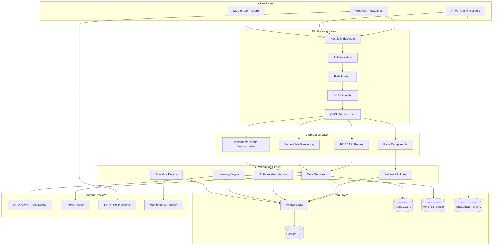

### Technology Stack Overview

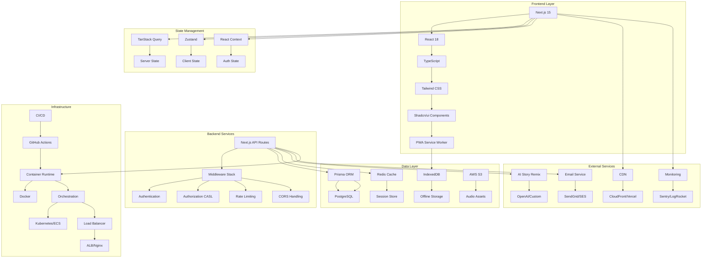

### Deployment Architecture Overview

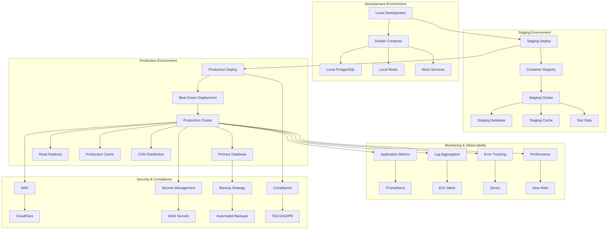

### Multi-Tenant Architecture

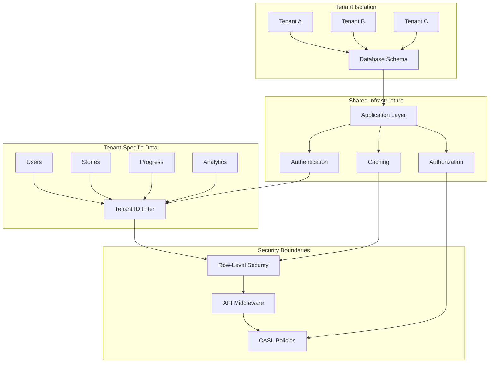

---

## Database ERD Diagrams

### Complete System Entity Relationships

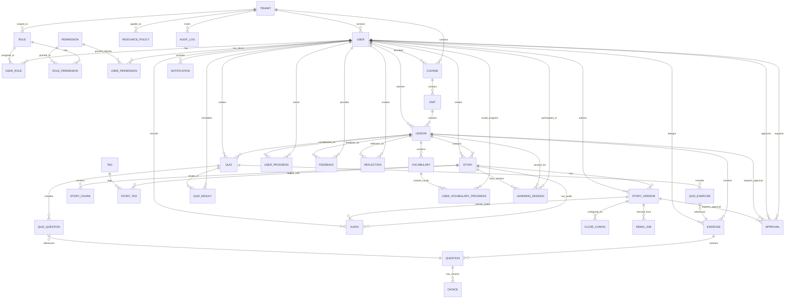

### Authentication & Authorization Schema

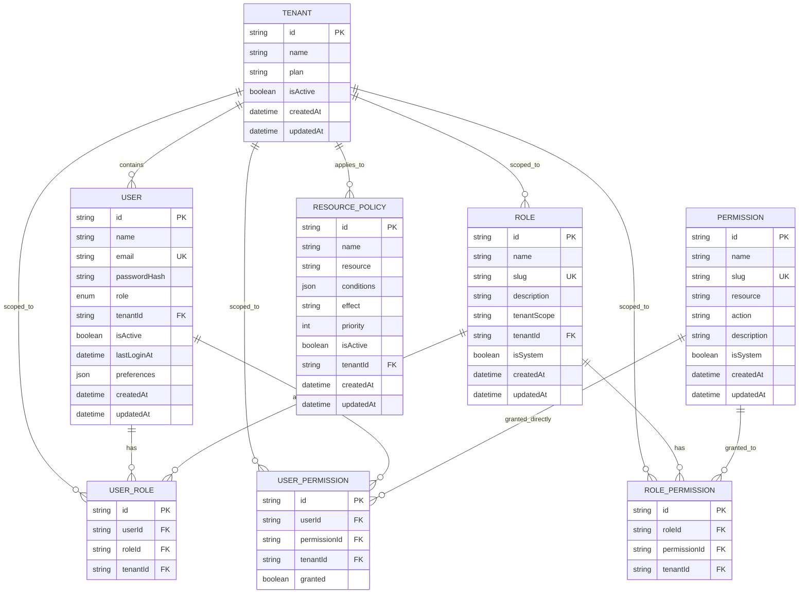

### Learning Content Schema

```mermaid
erDiagram
    COURSE {
        string id PK
        string title
        text description
        enum level
        enum difficulty
        string thumbnailUrl
        int estimatedHours
        string tenantId FK
        enum status
        string createdBy FK
        datetime createdAt
        datetime updatedAt
    }

    UNIT {
        string id PK
        string courseId FK
        string title
        int order
        string tenantId FK
    }

    LESSON {
        string id PK
        string unitId FK
        string courseId FK
        string title
        text description
        int order
        int estimatedMinutes
        string[] prerequisites
        string tenantId FK
        enum status
        datetime publishedAt
        string createdBy FK
        string approvedBy FK
        datetime createdAt
        datetime updatedAt
    }

    STORY {
        string id PK
        string lessonId FK
        string title
        text content
        enum storyType
        enum difficulty
        int estimatedMinutes
        int wordCount
        float chemRatio
        string tenantId FK
        string createdBy FK
        enum status
        datetime createdAt
        datetime updatedAt
    }

    STORY_VERSION {
        string id PK
        string storyId FK
        int version
        text content
        boolean isApproved
        boolean isPublished
        float chemingRatio
        string chemingScopes
        string createdBy FK
        string tenantId FK
        datetime createdAt
        datetime updatedAt
    }

    STORY_CHUNK {
        string id PK
        string storyId FK
        int chunkOrder
        text chunkText
        enum type
    }

    VOCABULARY {
        string id PK
        string lessonId FK
        string word
        string meaning
        string example
        string audioUrl
    }

    AUDIO {
        string id PK
        string lessonId FK
        string storyId FK
        string storyVersionId FK
        string storageKey
        string voiceType
        int durationSec
        string tenantId FK
        string createdBy FK
        enum status
        datetime createdAt
        datetime updatedAt
    }

    COURSE ||--o{ UNIT : contains
    UNIT ||--o{ LESSON : contains
    LESSON ||--o{ STORY : contains
    LESSON ||--o{ VOCABULARY : contains
    STORY ||--o{ STORY_VERSION : has
    STORY ||--o{ STORY_CHUNK : contains
    STORY ||--o{ AUDIO : has_audio
    STORY_VERSION ||--o{ AUDIO : version_audio
```

### Progress & Analytics Schema

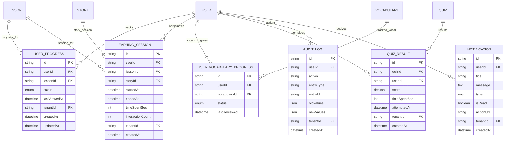

---

## Component Interaction Diagrams

### Learning Session Component Architecture

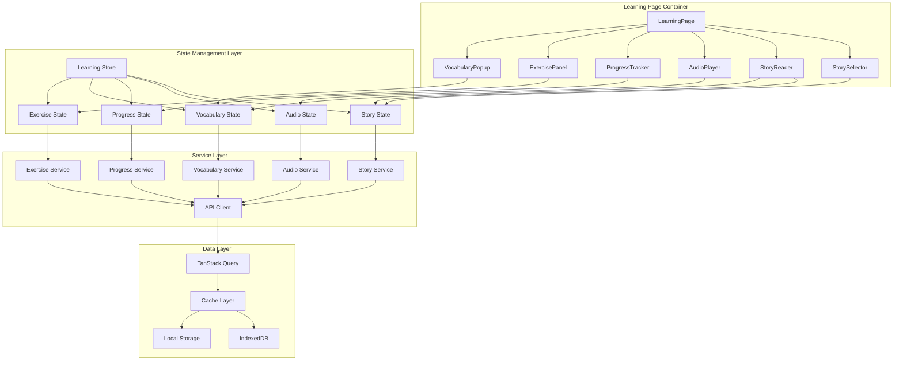

### Authentication & Authorization Flow

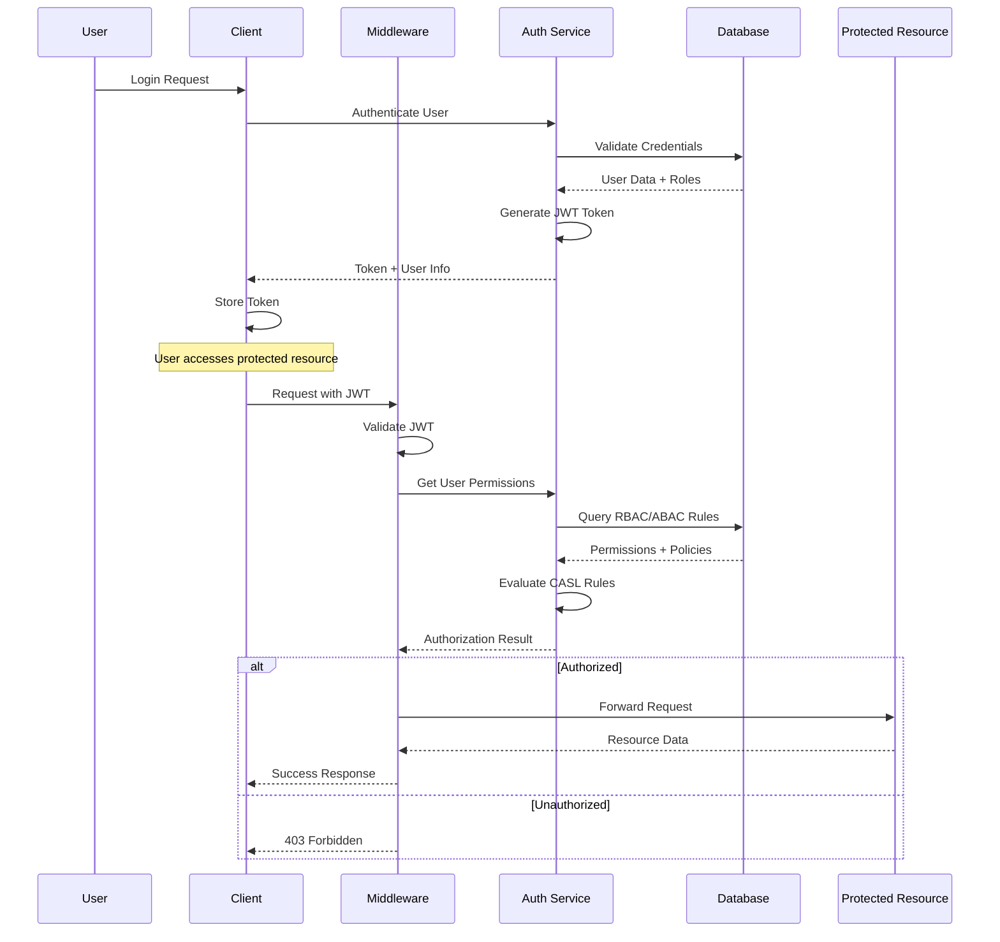

### Real-time Learning Analytics

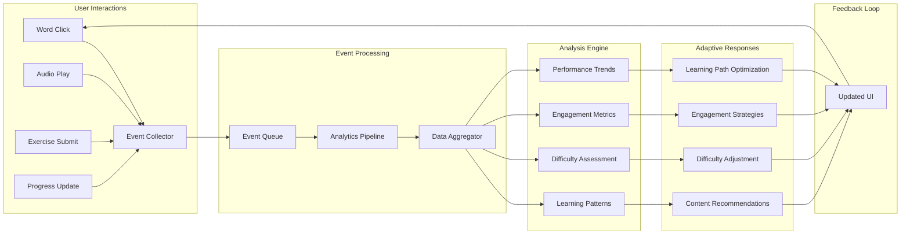

### Offline-First Synchronization

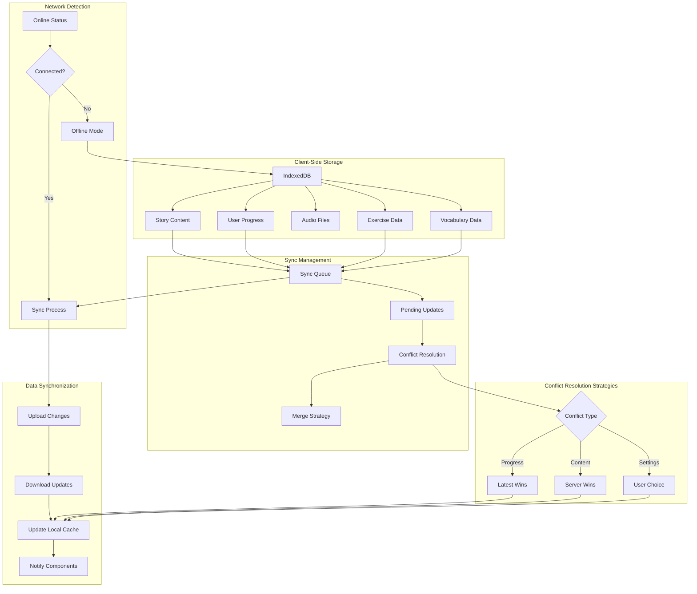

### Story Embedding (Chem) Processing

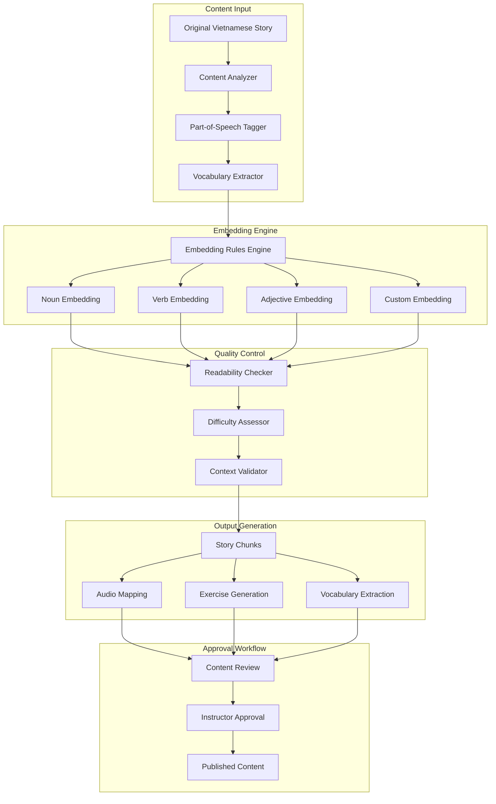

---

## User Flow Diagrams

### Complete Learning Journey

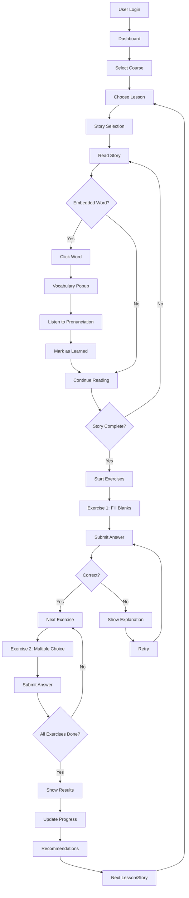

### Story Creation & Approval Workflow

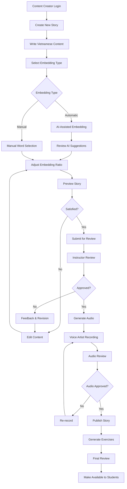

### Adaptive Learning Path

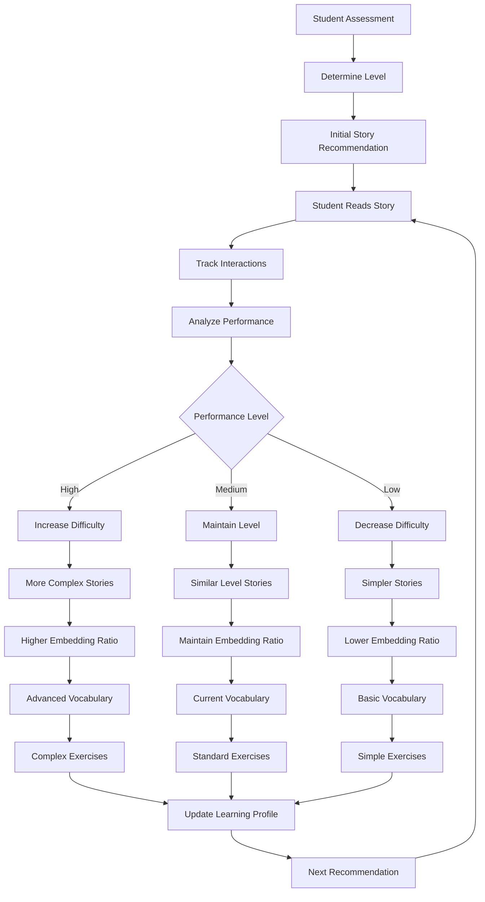

### Multi-Tenant User Management

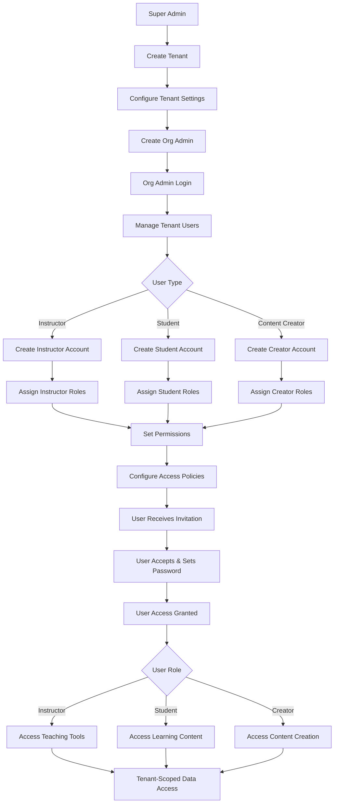

### Offline Learning Experience

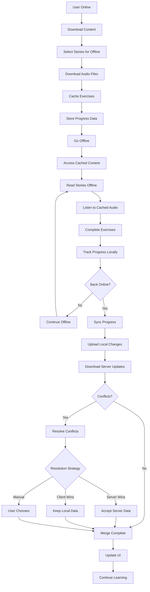

### Performance Monitoring & Analytics

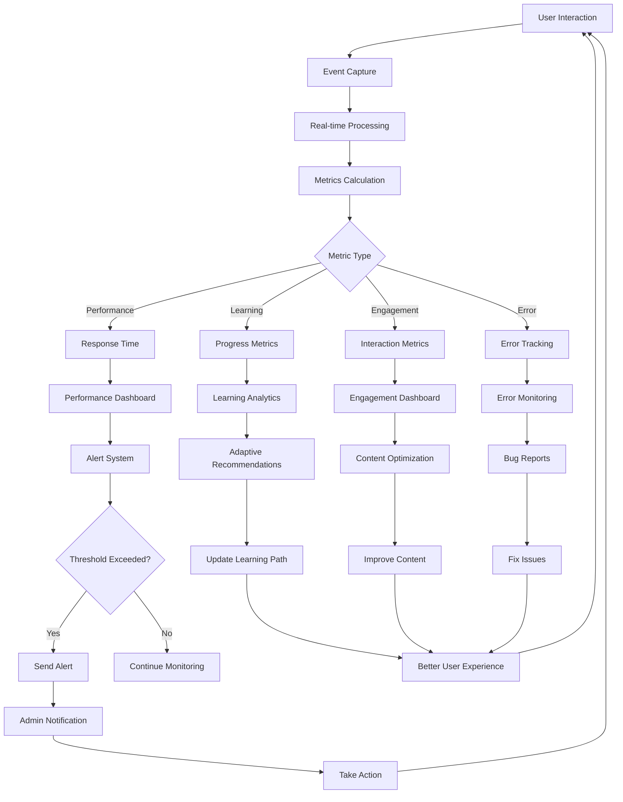

---

## Diagram Usage Guidelines

### For Developers

- Use **System Overview Diagrams** to understand overall architecture
- Reference **Component Interaction Diagrams** for implementation details
- Follow **Database ERD** for data modeling and relationships

### For Product Managers

- Review **User Flow Diagrams** for feature planning
- Use **Learning Journey** flows for user experience optimization
- Reference **Analytics Flow** for metrics and KPI tracking

### For DevOps Engineers

- Focus on **System Architecture** for deployment planning
- Use **Multi-Tenant Architecture** for infrastructure scaling
- Reference **Offline Sync** for caching and performance optimization

### For QA Engineers

- Use **User Flow Diagrams** for test case creation
- Reference **Component Interactions** for integration testing
- Follow **Error Handling** flows for edge case testing

---

## Maintenance Notes

These diagrams should be updated when:

- New features are added to the system
- Database schema changes occur
- Component architecture is modified
- User flows are updated or new flows are introduced
- Performance optimizations change the system architecture

Last Updated: January 2025

### Advanced Learning Analytics Pipeline

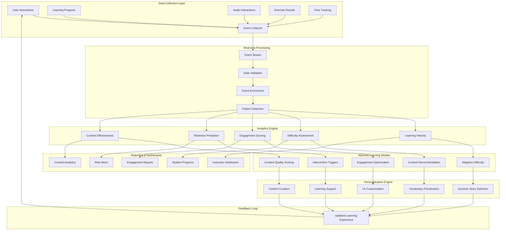

### Comprehensive Security Architecture

```mermaid
graph TD
    subgraph "Authentication Layer"
        A[User Login] --> B[Credential Validation]
        B --> C[Multi-Factor Auth]
        C --> D[JWT Token Generation]
        D --> E[Session Management]
    end

    subgraph "Authorization Layer"
        E --> F[RBAC Engine]
        F --> G[ABAC Policy Engine]
        G --> H[CASL Rule Evaluation]
        H --> I[Resource Access Control]
    end

    subgraph "Multi-Tenant Security"
        I --> J[Tenant Isolation]
        J --> K[Data Segregation]
        K --> L[Row-Level Security]
        L --> M[API Scoping]
    end

    subgraph "Data Protection"
        M --> N[Input Validation]
        N --> O[SQL Injection Prevention]
        O --> P[XSS Protection]
        P --> Q[CSRF Protection]
    end

    subgraph "Infrastructure Security"
        Q --> R[WAF Protection]
        R --> S[Rate Limiting]
        S --> T[DDoS Mitigation]
        T --> U[SSL/TLS Encryption]
    end

    subgraph "Compliance & Auditing"
        U --> V[Audit Logging]
        V --> W[GDPR Compliance]
        W --> X[Data Retention]
        X --> Y[Privacy Controls]
    end

    subgraph "Threat Detection"
        Y --> Z[Anomaly Detection]
        Z --> AA[Intrusion Detection]
        AA --> BB[Security Alerts]
        BB --> CC[Incident Response]
    end

    CC --> A
```

### Microservices Architecture (Future State)

```mermaid
graph TB
    subgraph "API Gateway"
        A[Kong/AWS API Gateway] --> B[Authentication Service]
        A --> C[Rate Limiting]
        A --> D[Load Balancing]
    end

    subgraph "Core Services"
        E[User Service] --> F[User Database]
        G[Content Service] --> H[Content Database]
        I[Learning Service] --> J[Learning Database]
        K[Analytics Service] --> L[Analytics Database]
    end

    subgraph "Supporting Services"
        M[Notification Service] --> N[Message Queue]
        O[File Service] --> P[Object Storage]
        Q[Search Service] --> R[Elasticsearch]
        S[Cache Service] --> T[Redis Cluster]
    end

    subgraph "External Integrations"
        U[AI Service] --> V[OpenAI/Custom ML]
        W[Email Service] --> X[SendGrid/SES]
        Y[CDN Service] --> Z[CloudFront/CloudFlare]
    end

    subgraph "Event-Driven Architecture"
        AA[Event Bus] --> BB[Learning Events]
        AA --> CC[User Events]
        AA --> DD[Content Events]
        AA --> EE[System Events]
    end

    A --> E
    A --> G
    A --> I
    A --> K

    E --> AA
    G --> AA
    I --> AA
    K --> AA

    AA --> M
    AA --> O
    AA --> Q

    I --> U
    M --> W
    G --> Y
```

### DevOps & CI/CD Pipeline

```mermaid
graph LR
    subgraph "Development"
        A[Developer] --> B[Git Commit]
        B --> C[Feature Branch]
        C --> D[Pull Request]
    end

    subgraph "CI Pipeline"
        D --> E[GitHub Actions]
        E --> F[Code Quality Check]
        F --> G[Unit Tests]
        G --> H[Integration Tests]
        H --> I[Security Scan]
        I --> J[Build Docker Image]
    end

    subgraph "CD Pipeline"
        J --> K[Push to Registry]
        K --> L[Deploy to Staging]
        L --> M[E2E Tests]
        M --> N[Performance Tests]
        N --> O[Security Tests]
    end

    subgraph "Production Deployment"
        O --> P{Manual Approval}
        P -->|Approved| Q[Blue-Green Deploy]
        P -->|Rejected| R[Rollback]
        Q --> S[Health Checks]
        S --> T[Traffic Routing]
    end

    subgraph "Monitoring"
        T --> U[Application Monitoring]
        U --> V[Log Aggregation]
        V --> W[Alerting]
        W --> X[Incident Response]
    end

    subgraph "Feedback Loop"
        X --> Y[Post-Incident Review]
        Y --> Z[Process Improvement]
        Z --> A
    end
```
