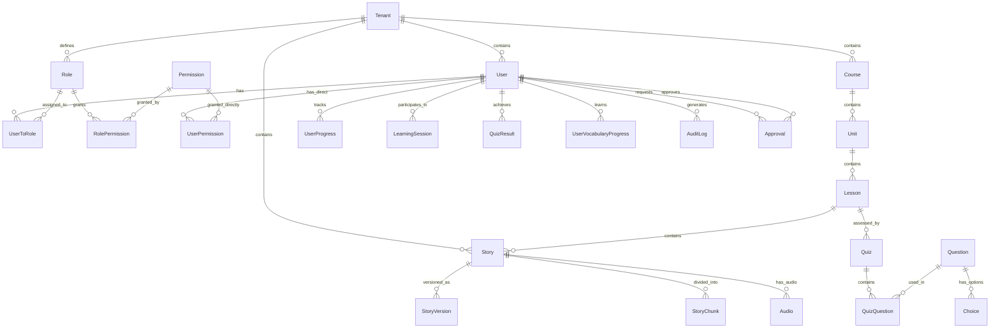

# Database Schema & Data Modeling Guide

This document provides comprehensive guidance on the database schema design, entity relationships, and data modeling decisions for the EdTech platform.

## Table of Contents

1. [Schema Overview](#schema-overview)
2. [Multi-Tenancy Architecture](#multi-tenancy-architecture)
3. [Authentication & Authorization](#authentication--authorization)
4. [Content Management](#content-management)
5. [Learning Analytics](#learning-analytics)
6. [Data Modeling Patterns](#data-modeling-patterns)
7. [Performance Considerations](#performance-considerations)
8. [Migration Strategies](#migration-strategies)

## Schema Overview

### Entity Relationship Diagram



### Database Statistics

| Category      | Tables | Key Relationships              |
| ------------- | ------ | ------------------------------ |
| Core System   | 3      | Tenant, User, Role             |
| Authorization | 6      | RBAC + ABAC support            |
| Content       | 12     | Hierarchical content structure |
| Learning      | 8      | Progress tracking & analytics  |
| Assessment    | 6      | Quizzes and exercises          |
| Workflow      | 4      | Approval and audit systems     |

## Multi-Tenancy Architecture

### Tenant Isolation Strategy

We use a **shared database, shared schema** approach with tenant-scoped data:

```sql
-- Every tenant-scoped table includes tenant_id
CREATE TABLE stories (
    id UUID PRIMARY KEY DEFAULT gen_random_uuid(),
    tenant_id UUID NOT NULL REFERENCES tenants(id),
    title VARCHAR(255) NOT NULL,
    content TEXT NOT NULL,
    -- ... other fields

    -- Composite indexes for tenant isolation
    INDEX idx_stories_tenant_status (tenant_id, status),
    INDEX idx_stories_tenant_created (tenant_id, created_at DESC)
);
```

### Tenant Scoping Patterns

```typescript
// Repository pattern with automatic tenant scoping
export class TenantScopedRepository<T> {
  constructor(
    private model: any,
    private tenantId: string
  ) {}

  async findMany(filters: any = {}): Promise<T[]> {
    return this.model.findMany({
      where: {
        tenantId: this.tenantId,
        ...filters,
      },
    });
  }

  async create(data: any): Promise<T> {
    return this.model.create({
      data: {
        ...data,
        tenantId: this.tenantId,
      },
    });
  }

  async update(id: string, data: any): Promise<T> {
    return this.model.update({
      where: {
        id,
        tenantId: this.tenantId, // Prevents cross-tenant updates
      },
      data,
    });
  }
}

// Usage in services
export class StoryService {
  private repository: TenantScopedRepository<Story>;

  constructor(tenantId: string) {
    this.repository = new TenantScopedRepository(prisma.story, tenantId);
  }

  async getPublishedStories(): Promise<Story[]> {
    return this.repository.findMany({ status: "published" });
  }
}
```

### Global vs Tenant-Scoped Resources

```typescript
// Some entities can be global or tenant-scoped
model Role {
  id          String  @id @default(uuid())
  name        String
  slug        String  @unique
  tenantScope String? // "system", "tenant", or null for global
  tenantId    String? // null for global roles
  isSystem    Boolean @default(false)

  // Relations
  tenant Tenant? @relation(fields: [tenantId], references: [id])

  @@index([tenantScope, tenantId])
}

// Global system roles (tenantId = null)
// - super_admin: Platform-wide administration
// - system_admin: Cross-tenant operations

// Tenant-scoped roles (tenantId = specific tenant)
// - admin: Tenant administration
// - teacher: Content creation and management
// - student: Learning activities
```

## Authentication & Authorization

### RBAC (Role-Based Access Control)

```typescript
// User-Role relationship with tenant scoping
model UserToRole {
  id       String  @id @default(uuid())
  userId   String
  roleId   String
  tenantId String? // Allows global and tenant-specific role assignments

  user   User    @relation(fields: [userId], references: [id])
  role   Role    @relation(fields: [roleId], references: [id])
  tenant Tenant? @relation(fields: [tenantId], references: [id])

  @@unique([userId, roleId, tenantId])
}

// Permission system
model Permission {
  id       String @id @default(uuid())
  name     String
  slug     String @unique
  resource String // "story", "lesson", "user"
  action   String // "create", "read", "update", "delete"

  @@unique([resource, action])
  @@index([resource])
}

// Role-Permission mapping
model RolePermission {
  id           String  @id @default(uuid())
  roleId       String
  permissionId String
  tenantId     String? // Tenant-specific permission grants

  role       Role       @relation(fields: [roleId], references: [id])
  permission Permission @relation(fields: [permissionId], references: [id])
  tenant     Tenant?    @relation(fields: [tenantId], references: [id])

  @@unique([roleId, permissionId])
}
```

### ABAC (Attribute-Based Access Control)

```typescript
// Dynamic policies for complex authorization
model ResourcePolicy {
  id         String  @id @default(uuid())
  name       String
  resource   String  // "story", "lesson", etc.
  conditions Json    // Complex conditions as JSON
  effect     String  // "allow" or "deny"
  priority   Int     @default(0) // Higher priority = evaluated first
  isActive   Boolean @default(true)
  tenantId   String?

  tenant Tenant? @relation(fields: [tenantId], references: [id])

  @@index([resource, priority])
  @@index([isActive])
}

// Example policy conditions
interface PolicyCondition {
  field: string;
  operator: 'eq' | 'ne' | 'in' | 'nin' | 'gt' | 'lt' | 'contains';
  value: any;
  logic?: 'and' | 'or';
}

// Example policies
const storyAccessPolicy: PolicyCondition[] = [
  {
    field: 'story.status',
    operator: 'eq',
    value: 'published',
  },
  {
    field: 'user.role',
    operator: 'in',
    value: ['student', 'teacher'],
    logic: 'and',
  },
  {
    field: 'story.difficulty',
    operator: 'eq',
    value: 'user.level', // Dynamic reference
    logic: 'and',
  },
];
```

### Authorization Implementation

```typescript
// CASL ability definition
export function defineAbilityFor(user: User, policies: ResourcePolicy[]) {
  return defineAbility((can, cannot) => {
    // Basic role-based permissions
    user.roles.forEach((role) => {
      role.permissions.forEach((permission) => {
        can(permission.action, permission.resource);
      });
    });

    // Apply attribute-based policies
    policies.forEach((policy) => {
      if (evaluatePolicy(policy, user)) {
        if (policy.effect === "allow") {
          can("manage", policy.resource);
        } else {
          cannot("manage", policy.resource);
        }
      }
    });

    // Resource-specific rules
    can("read", "Story", { status: "published" });
    can("update", "Story", { createdBy: user.id });
    can("read", "Lesson", {
      course: {
        enrollments: {
          some: { userId: user.id },
        },
      },
    });
  });
}

// Policy evaluation engine
function evaluatePolicy(
  policy: ResourcePolicy,
  user: User,
  resource?: any
): boolean {
  const conditions = policy.conditions as PolicyCondition[];

  return conditions.every((condition) => {
    const value = getFieldValue(condition.field, { user, resource });
    return evaluateCondition(value, condition.operator, condition.value);
  });
}
```

## Content Management

### Hierarchical Content Structure

```typescript
// Content hierarchy: Course -> Unit -> Lesson -> Story
model Course {
  id          String        @id @default(uuid())
  title       String
  description String?
  level       LearningLevel
  difficulty  DifficultyLevel
  tenantId    String
  status      ContentStatus @default(draft)
  createdBy   String
  createdAt   DateTime      @default(now())
  updatedAt   DateTime      @updatedAt

  // Relations
  tenant  Tenant   @relation(fields: [tenantId], references: [id])
  creator User     @relation("CreatedCourse", fields: [createdBy], references: [id])
  units   Unit[]
  lessons Lesson[]

  @@index([tenantId, status])
  @@index([level, difficulty])
}

model Unit {
  id       String @id @default(uuid())
  courseId String
  title    String
  order    Int
  tenantId String

  course  Course   @relation(fields: [courseId], references: [id])
  tenant  Tenant   @relation(fields: [tenantId], references: [id])
  lessons Lesson[]

  @@index([courseId, order])
}

model Lesson {
  id               String        @id @default(uuid())
  unitId           String
  courseId         String
  title            String
  description      String?
  order            Int
  estimatedMinutes Int?
  prerequisites    String[]      // Array of lesson IDs
  tenantId         String
  status           ContentStatus @default(draft)
  publishedAt      DateTime?
  createdBy        String
  approvedBy       String?

  // Relations
  unit     Unit     @relation(fields: [unitId], references: [id])
  course   Course   @relation(fields: [courseId], references: [id])
  tenant   Tenant   @relation(fields: [tenantId], references: [id])
  creator  User     @relation("CreatedLesson", fields: [createdBy], references: [id])
  approver User?    @relation("ApprovedLesson", fields: [approvedBy], references: [id])
  stories  Story[]

  @@index([courseId, unitId, order])
  @@index([status, publishedAt])
}
```

### Story Embedding System

```typescript
// Core story entity with embedding support
model Story {
  id               String        @id @default(uuid())
  lessonId         String?       // Optional - stories can exist independently
  title            String
  content          String        @db.Text
  storyType        StoryType     @default(original)
  difficulty       DifficultyLevel
  estimatedMinutes Int?
  wordCount        Int?
  chemRatio        Float?        // Percentage of English words embedded
  tenantId         String
  createdBy        String
  status           ContentStatus @default(draft)

  // Relations
  lesson   Lesson?        @relation(fields: [lessonId], references: [id])
  tenant   Tenant         @relation(fields: [tenantId], references: [id])
  creator  User           @relation("CreatedStory", fields: [createdBy], references: [id])
  versions StoryVersion[]
  chunks   StoryChunk[]
  audios   Audio[]

  @@index([tenantId, status])
  @@index([storyType, difficulty])
  @@index([lessonId])
}

// Story versioning for content management
model StoryVersion {
  id            String   @id @default(uuid())
  storyId       String
  version       Int
  content       String   @db.Text
  isApproved    Boolean  @default(false)
  isPublished   Boolean  @default(false)
  chemingRatio  Float?   // Embedding ratio for this version
  chemingScopes String?  // JSON of embedding scopes
  createdBy     String
  tenantId      String

  story   Story  @relation(fields: [storyId], references: [id])
  creator User   @relation("CreatedStoryVersion", fields: [createdBy], references: [id])
  tenant  Tenant @relation(fields: [tenantId], references: [id])

  @@unique([storyId, version])
  @@index([storyId, isPublished])
}

// Story chunks for precise control
model StoryChunk {
  id         String    @id @default(uuid())
  storyId    String
  chunkOrder Int
  chunkText  String    @db.Text
  type       ChunkType // normal, chem, explain

  story Story @relation(fields: [storyId], references: [id], onDelete: Cascade)

  @@index([storyId, chunkOrder])
}

// Embedding configuration
model ClozeConfig {
  id             String @id @default(uuid())
  storyVersionId String
  partOfSpeech   String // "noun", "verb", "adjective"
  ratio          Float  // Embedding ratio for this part of speech
  tenantId       String

  storyVersion StoryVersion @relation(fields: [storyVersionId], references: [id])
  tenant       Tenant       @relation(fields: [tenantId], references: [id])

  @@index([storyVersionId])
}
```

### Audio Asset Management

```typescript
model Audio {
  id          String   @id @default(uuid())
  lessonId    String?
  storyId     String?
  storageKey  String   // S3 or CDN key
  voiceType   String   // "male", "female", "child"
  durationSec Int?
  tenantId    String
  createdBy   String
  status      String   @default("draft") // draft, processed, published

  // Relations
  lesson           Lesson?       @relation(fields: [lessonId], references: [id])
  story            Story?        @relation(fields: [storyId], references: [id])
  storyVersion     StoryVersion? @relation("StoryVersionAudio", fields: [storyVersionId], references: [id])
  storyVersionId   String?
  tenant           Tenant        @relation(fields: [tenantId], references: [id])
  creator          User          @relation("CreatedAudio", fields: [createdBy], references: [id])
  recordedBy       User?         @relation("RecordedAudio", fields: [recordedByUserId], references: [id])
  recordedByUserId String?

  @@index([tenantId, status])
  @@index([storyId])
  @@index([lessonId])
}
```

## Learning Analytics

### Progress Tracking

```typescript
// User progress at lesson level
model UserProgress {
  id           String         @id @default(uuid())
  userId       String
  lessonId     String
  status       ProgressStatus @default(not_started)
  lastViewedAt DateTime?
  tenantId     String
  createdAt    DateTime       @default(now())
  updatedAt    DateTime       @updatedAt

  user   User   @relation(fields: [userId], references: [id])
  lesson Lesson @relation(fields: [lessonId], references: [id])
  tenant Tenant @relation(fields: [tenantId], references: [id])

  @@unique([userId, lessonId])
  @@index([userId, status])
  @@index([lessonId])
}

// Detailed learning sessions
model LearningSession {
  id               String   @id @default(uuid())
  userId           String
  lessonId         String?
  storyId          String?
  startedAt        DateTime
  endedAt          DateTime?
  timeSpentSec     Int?
  interactionCount Int?     // Number of interactions (clicks, plays, etc.)
  tenantId         String

  user   User    @relation(fields: [userId], references: [id])
  lesson Lesson? @relation(fields: [lessonId], references: [id])
  story  Story?  @relation(fields: [storyId], references: [id])
  tenant Tenant  @relation(fields: [tenantId], references: [id])

  @@index([userId, startedAt])
  @@index([lessonId])
  @@index([storyId])
}

// Vocabulary learning progress
model UserVocabularyProgress {
  id           String      @id @default(uuid())
  userId       String
  vocabularyId String
  status       VocabStatus @default(new)
  lastReviewed DateTime?

  user       User       @relation(fields: [userId], references: [id])
  vocabulary Vocabulary @relation(fields: [vocabularyId], references: [id])

  @@unique([userId, vocabularyId])
  @@index([userId, status])
}
```

### Assessment System

```typescript
// Quiz structure
model Quiz {
  id          String   @id @default(uuid())
  lessonId    String
  title       String
  description String?
  tenantId    String
  status      String   @default("draft")
  createdBy   String

  lesson        Lesson         @relation(fields: [lessonId], references: [id])
  tenant        Tenant         @relation(fields: [tenantId], references: [id])
  creator       User           @relation("CreatedQuiz", fields: [createdBy], references: [id])
  questions     QuizQuestion[]
  quizResults   QuizResult[]

  @@index([lessonId])
  @@index([tenantId, status])
}

// Flexible question system
model Question {
  id         String       @id @default(uuid())
  exerciseId String
  stem       String       @db.Text
  type       QuestionType // MCQ, fill_blank, drag_drop, short_answer
  tenantId   String

  exercise      Exercise       @relation(fields: [exerciseId], references: [id])
  tenant        Tenant         @relation(fields: [tenantId], references: [id])
  choices       Choice[]
  quizQuestions QuizQuestion[]

  @@index([exerciseId])
  @@index([type])
}

// Quiz results with detailed analytics
model QuizResult {
  id           String   @id @default(uuid())
  quizId       String
  userId       String
  score        Decimal  @db.Decimal(5,2)
  timeSpentSec Int
  attemptedAt  DateTime
  tenantId     String

  quiz   Quiz   @relation(fields: [quizId], references: [id])
  user   User   @relation(fields: [userId], references: [id])
  tenant Tenant @relation(fields: [tenantId], references: [id])

  @@index([userId, attemptedAt])
  @@index([quizId])
}
```

## Data Modeling Patterns

### Audit Trail Pattern

```typescript
// Comprehensive audit logging
model AuditLog {
  id         String   @id @default(uuid())
  userId     String
  action     String   // CREATE, UPDATE, DELETE
  entityType String   // User, Story, Lesson, etc.
  entityId   String
  oldValues  Json?    // Previous state
  newValues  Json?    // New state
  tenantId   String
  createdAt  DateTime @default(now())

  user   User   @relation(fields: [userId], references: [id])
  tenant Tenant @relation(fields: [tenantId], references: [id])

  @@index([userId, createdAt])
  @@index([entityType, entityId])
  @@index([tenantId, createdAt])
}

// Usage in application
export async function auditAction(
  userId: string,
  action: string,
  entityType: string,
  entityId: string,
  oldValues?: any,
  newValues?: any,
  tenantId?: string
) {
  await prisma.auditLog.create({
    data: {
      userId,
      action,
      entityType,
      entityId,
      oldValues: oldValues ? JSON.stringify(oldValues) : null,
      newValues: newValues ? JSON.stringify(newValues) : null,
      tenantId,
    },
  });
}
```

### Approval Workflow Pattern

```typescript
// Generic approval system
model Approval {
  id          String   @id @default(uuid())
  entityType  String   // StoryVersion, Lesson, etc.
  entityId    String
  requestedBy String
  approvedBy  String?
  status      String   @default("pending") // pending, approved, rejected
  tenantId    String
  createdAt   DateTime @default(now())
  updatedAt   DateTime @updatedAt

  requester User   @relation("RequestedApproval", fields: [requestedBy], references: [id])
  approver  User?  @relation("ApprovedApproval", fields: [approvedBy], references: [id])
  tenant    Tenant @relation(fields: [tenantId], references: [id])

  @@index([entityType, entityId])
  @@index([status, createdAt])
}

// Workflow implementation
export class ApprovalWorkflow {
  async requestApproval(
    entityType: string,
    entityId: string,
    requestedBy: string,
    tenantId: string
  ): Promise<Approval> {
    return prisma.approval.create({
      data: {
        entityType,
        entityId,
        requestedBy,
        tenantId,
      },
    });
  }

  async approveEntity(
    approvalId: string,
    approvedBy: string
  ): Promise<Approval> {
    return prisma.approval.update({
      where: { id: approvalId },
      data: {
        status: 'approved',
        approvedBy,
        updatedAt: new Date(),
      },
    });
  }
}
```

### Soft Delete Pattern

```typescript
// Soft delete with status field
model Story {
  // ... other fields
  status    ContentStatus @default(draft) // draft, published, archived
  deletedAt DateTime?

  @@index([status, deletedAt])
}

// Repository methods with soft delete support
export class SoftDeleteRepository<T> {
  constructor(private model: any) {}

  async findMany(includeDeleted = false): Promise<T[]> {
    return this.model.findMany({
      where: includeDeleted ? {} : { deletedAt: null },
    });
  }

  async softDelete(id: string): Promise<T> {
    return this.model.update({
      where: { id },
      data: { deletedAt: new Date() },
    });
  }

  async restore(id: string): Promise<T> {
    return this.model.update({
      where: { id },
      data: { deletedAt: null },
    });
  }

  async hardDelete(id: string): Promise<T> {
    return this.model.delete({
      where: { id },
    });
  }
}
```

### Polymorphic Associations

```typescript
// Tagging system with polymorphic associations
model Tag {
  id       String @id @default(uuid())
  name     String
  tenantId String

  tenant  Tenant     @relation(fields: [tenantId], references: [id])
  stories StoryTag[]

  @@index([tenantId, name])
}

model StoryTag {
  storyId String
  tagId   String

  story Story @relation(fields: [storyId], references: [id], onDelete: Cascade)
  tag   Tag   @relation(fields: [tagId], references: [id], onDelete: Cascade)

  @@id([storyId, tagId])
}

// Generic taggable interface
interface Taggable {
  id: string;
  tags: Tag[];
}

// Service for managing tags
export class TagService {
  async addTagToEntity(
    entityType: string,
    entityId: string,
    tagId: string
  ): Promise<void> {
    const relationTable = `${entityType.toLowerCase()}Tag`;
    const entityIdField = `${entityType.toLowerCase()}Id`;

    await prisma[relationTable].create({
      data: {
        [entityIdField]: entityId,
        tagId,
      },
    });
  }

  async getTagsForEntity(
    entityType: string,
    entityId: string
  ): Promise<Tag[]> {
    const relationTable = `${entityType.toLowerCase()}Tag`;
    const entityIdField = `${entityType.toLowerCase()}Id`;

    const relations = await prisma[relationTable].findMany({
      where: { [entityIdField]: entityId },
      include: { tag: true },
    });

    return relations.map(rel => rel.tag);
  }
}
```

## Performance Considerations

### Indexing Strategy

```sql
-- Tenant-scoped queries (most common)
CREATE INDEX idx_stories_tenant_status ON stories(tenant_id, status);
CREATE INDEX idx_stories_tenant_created ON stories(tenant_id, created_at DESC);

-- Learning analytics queries
CREATE INDEX idx_learning_sessions_user_date ON learning_sessions(user_id, started_at DESC);
CREATE INDEX idx_user_progress_status ON user_progress(user_id, status);

-- Content hierarchy queries
CREATE INDEX idx_lessons_course_unit_order ON lessons(course_id, unit_id, "order");
CREATE INDEX idx_story_chunks_story_order ON story_chunks(story_id, chunk_order);

-- Search and filtering
CREATE INDEX idx_stories_difficulty_type ON stories(difficulty, story_type);
CREATE INDEX idx_users_role_active ON users(role, is_active);

-- Audit and monitoring
CREATE INDEX idx_audit_logs_entity ON audit_logs(entity_type, entity_id);
CREATE INDEX idx_audit_logs_tenant_date ON audit_logs(tenant_id, created_at DESC);
```

### Query Optimization

```typescript
// Efficient pagination with cursor-based approach
export async function getPaginatedStories(
  tenantId: string,
  cursor?: string,
  limit = 20
): Promise<{ stories: Story[]; nextCursor?: string }> {
  const stories = await prisma.story.findMany({
    where: {
      tenantId,
      status: "published",
      ...(cursor && { id: { gt: cursor } }),
    },
    orderBy: { createdAt: "desc" },
    take: limit + 1, // Take one extra to check if there's a next page
  });

  const hasNextPage = stories.length > limit;
  const items = hasNextPage ? stories.slice(0, -1) : stories;
  const nextCursor = hasNextPage ? items[items.length - 1].id : undefined;

  return { stories: items, nextCursor };
}

// Optimized queries with selective field loading
export async function getStoriesWithMinimalData(
  tenantId: string
): Promise<Partial<Story>[]> {
  return prisma.story.findMany({
    where: { tenantId, status: "published" },
    select: {
      id: true,
      title: true,
      difficulty: true,
      storyType: true,
      estimatedMinutes: true,
      createdAt: true,
      // Exclude heavy fields like content
    },
    orderBy: { createdAt: "desc" },
  });
}

// Batch loading for N+1 prevention
export async function getStoriesWithChunks(
  storyIds: string[]
): Promise<(Story & { chunks: StoryChunk[] })[]> {
  return prisma.story.findMany({
    where: { id: { in: storyIds } },
    include: {
      chunks: {
        orderBy: { chunkOrder: "asc" },
      },
    },
  });
}
```

### Connection Pooling

```typescript
// Prisma connection configuration
const prisma = new PrismaClient({
  datasources: {
    db: {
      url: process.env.DATABASE_URL,
    },
  },
  // Connection pool settings
  __internal: {
    engine: {
      connectionLimit: 20,
      poolTimeout: 10000,
      idleTimeout: 30000,
    },
  },
});

// Connection management for serverless
let prismaInstance: PrismaClient;

export function getPrismaClient(): PrismaClient {
  if (!prismaInstance) {
    prismaInstance = new PrismaClient();
  }
  return prismaInstance;
}

// Graceful shutdown
process.on("beforeExit", async () => {
  await prismaInstance?.$disconnect();
});
```

## Migration Strategies

### Schema Evolution

```typescript
// Migration for adding new fields
-- Migration: 20240101000000_add_embedding_ratio
ALTER TABLE stories ADD COLUMN chem_ratio DECIMAL(3,2);
CREATE INDEX idx_stories_chem_ratio ON stories(chem_ratio) WHERE chem_ratio IS NOT NULL;

-- Migration: 20240101000001_add_story_chunks
CREATE TABLE story_chunks (
    id UUID PRIMARY KEY DEFAULT gen_random_uuid(),
    story_id UUID NOT NULL REFERENCES stories(id) ON DELETE CASCADE,
    chunk_order INTEGER NOT NULL,
    chunk_text TEXT NOT NULL,
    type VARCHAR(20) NOT NULL DEFAULT 'normal',
    created_at TIMESTAMP DEFAULT NOW()
);

CREATE INDEX idx_story_chunks_story_order ON story_chunks(story_id, chunk_order);
```

### Data Migration Scripts

```typescript
// Prisma migration script
import { PrismaClient } from "@prisma/client";

const prisma = new PrismaClient();

async function migrateStoryChunks() {
  const stories = await prisma.story.findMany({
    where: { chunks: { none: {} } }, // Stories without chunks
  });

  for (const story of stories) {
    // Split content into chunks (simplified)
    const chunks = story.content.split("\n\n").filter((chunk) => chunk.trim());

    await prisma.storyChunk.createMany({
      data: chunks.map((chunkText, index) => ({
        storyId: story.id,
        chunkOrder: index,
        chunkText: chunkText.trim(),
        type: "normal",
      })),
    });
  }

  console.log(`Migrated ${stories.length} stories to chunk format`);
}

// Run migration
migrateStoryChunks()
  .catch(console.error)
  .finally(() => prisma.$disconnect());
```

### Backup and Recovery

```bash
#!/bin/bash
# Database backup script

# Environment variables
DB_HOST=${DB_HOST:-localhost}
DB_PORT=${DB_PORT:-5432}
DB_NAME=${DB_NAME:-edtech_db}
DB_USER=${DB_USER:-postgres}
BACKUP_DIR=${BACKUP_DIR:-/backups}

# Create backup with timestamp
TIMESTAMP=$(date +%Y%m%d_%H%M%S)
BACKUP_FILE="${BACKUP_DIR}/edtech_backup_${TIMESTAMP}.sql"

# Create backup
pg_dump -h $DB_HOST -p $DB_PORT -U $DB_USER -d $DB_NAME \
  --verbose --clean --no-owner --no-privileges \
  --file=$BACKUP_FILE

# Compress backup
gzip $BACKUP_FILE

# Clean old backups (keep last 7 days)
find $BACKUP_DIR -name "edtech_backup_*.sql.gz" -mtime +7 -delete

echo "Backup completed: ${BACKUP_FILE}.gz"
```

This comprehensive database schema guide provides the foundation for understanding and working with the EdTech platform's data layer, ensuring scalable, maintainable, and performant database operations.
