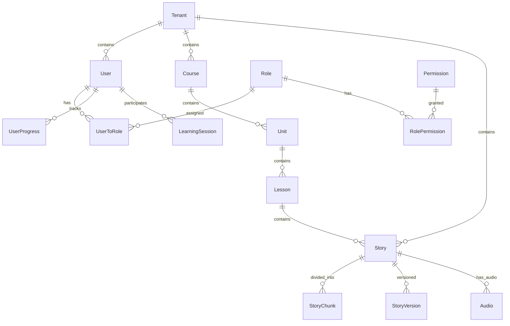

# Developer Onboarding Guide

Welcome to the EdTech English Learning Platform! This comprehensive guide will help you understand the project structure, architecture patterns, and development practices used in this application.

## Table of Contents

1. [Project Overview](#project-overview)
2. [Project Structure](#project-structure)
3. [API Design Patterns](#api-design-patterns)
4. [State Management Architecture](#state-management-architecture)
5. [Database Schema & Data Modeling](#database-schema--data-modeling)
6. [Development Setup](#development-setup)
7. [Key Concepts](#key-concepts)
8. [Best Practices](#best-practices)
9. [Additional Resources](#additional-resources)

## Project Overview

This is a Next.js 15 application implementing a unique "Jewish-style story embedding" (truyện chêm) methodology for English language learning. The platform features:

- **Multi-tenant architecture** with RBAC/ABAC authorization
- **Progressive Web App (PWA)** with offline capabilities
- **Real-time learning analytics** and adaptive difficulty
- **Audio-synchronized story reading** with embedded vocabulary
- **Comprehensive testing strategy** (unit, integration, E2E)

### Technology Stack

- **Frontend**: Next.js 15 (App Router), React 19, TypeScript
- **State Management**: TanStack Query + Zustand
- **Database**: PostgreSQL with Prisma ORM
- **Authentication**: JWT with refresh tokens
- **Authorization**: CASL (RBAC + ABAC)
- **Styling**: Tailwind CSS + Radix UI
- **Testing**: Jest + Testing Library + Playwright
- **Documentation**: Storybook

## Project Structure

### Root Level Organization

```
my-app/
├── .kiro/                    # Kiro IDE specifications and configurations
│   └── specs/               # Feature specifications and implementation plans
├── docs/                    # Project documentation
├── prisma/                  # Database schema and migrations
├── public/                  # Static assets and service worker
├── src/                     # Source code (detailed below)
├── coverage/                # Test coverage reports
├── .storybook/             # Storybook configuration
└── configuration files     # Package.json, tsconfig, etc.
```

### Source Code Structure (`src/`)

The source code follows a feature-based architecture with clear separation of concerns:

```
src/
├── app/                     # Next.js App Router pages and API routes
│   ├── api/                # API route handlers
│   ├── admin/              # Admin dashboard pages
│   ├── learning/           # Learning module pages and components
│   ├── login/              # Authentication pages
│   └── ...                 # Other page routes
├── components/             # Reusable UI components
│   ├── admin/              # Admin-specific components
│   ├── auth/               # Authentication components
│   ├── debug/              # Development/debugging components
│   ├── layout/             # Layout components
│   └── ui/                 # Base UI components (buttons, inputs, etc.)
├── config/                 # Configuration modules
│   ├── api/                # API configuration and defaults
│   ├── business/           # Business logic configuration
│   └── ui/                 # UI configuration (themes, colors)
├── contexts/               # React contexts
├── core/                   # Core system modules
│   ├── api/                # API client and utilities
│   ├── auth/               # Authentication and authorization
│   ├── state/              # State management utilities
│   └── prisma.ts           # Database client
├── dto/                    # Data Transfer Objects and validation schemas
├── features/               # Feature-specific modules
│   ├── auth/               # Authentication feature state
│   ├── learning/           # Learning feature logic
│   ├── stories/            # Stories feature state
│   └── ...                 # Other feature modules
├── hooks/                  # Custom React hooks
├── lib/                    # Utility libraries
├── shared/                 # Shared components and utilities
├── stories/                # Storybook stories
└── types/                  # TypeScript type definitions
```

### Key Directory Explanations

#### `/app` - Next.js App Router

- **Pages**: Each folder represents a route (e.g., `/learning`, `/admin`)
- **API Routes**: RESTful API endpoints following Next.js conventions
- **Layouts**: Shared layouts for different sections of the app
- **Loading/Error**: Loading states and error boundaries

#### `/components` - UI Components

- **Hierarchical organization**: From specific (`admin/`) to generic (`ui/`)
- **Co-located stories**: Each component has a corresponding `.stories.mdx` file
- **Atomic design principles**: Base components in `ui/`, composed components in feature folders

#### `/core` - System Core

- **API layer**: Centralized HTTP client with interceptors and error handling
- **Auth system**: CASL-based authorization with JWT token management
- **State utilities**: Zustand store factory and utilities

#### `/features` - Feature Modules

- **Domain-driven design**: Each feature encapsulates its own state, hooks, and types
- **Separation of concerns**: UI components in `/components`, business logic in `/features`
- **Consistent patterns**: Each feature follows the same structure

#### `/lib` - Utilities

- **Pure functions**: No side effects, easily testable
- **Cross-cutting concerns**: Logging, analytics, notifications
- **Helper functions**: Common utilities used across the application

## API Design Patterns

### RESTful API Conventions

Our API follows REST principles with consistent patterns:

```typescript
// Resource-based URLs
GET    /api/stories           # List stories
POST   /api/stories           # Create story
GET    /api/stories/[id]      # Get specific story
PUT    /api/stories/[id]      # Update story
DELETE /api/stories/[id]      # Delete story

// Nested resources
GET    /api/stories/[id]/chunks    # Get story chunks
POST   /api/learning/progress      # Update learning progress
GET    /api/users/[id]/progress    # Get user progress
```

### API Client Architecture

The API client uses a centralized approach with interceptors:

```typescript
// Core API client with interceptors
import { apiClient } from "@/core/api/api";

// Request interceptor - adds auth headers, CSRF tokens
apiClient.addRequestInterceptor(async (config) => {
  // Auto-attach JWT tokens
  const token = tokenManager.getAccessTokenSync();
  if (token) {
    config.headers.set("Authorization", `Bearer ${token}`);
  }

  // Add CSRF protection for mutations
  if (!["GET", "HEAD", "OPTIONS"].includes(config.method)) {
    const csrf = await getCSRFToken();
    if (csrf) config.headers.set("X-CSRF-Token", csrf);
  }

  return config;
});

// Response interceptor - handles common responses
apiClient.addResponseInterceptor(async (response) => {
  // Log API calls in development
  logger.debug(`API ${response.status} ${response.url}`);
  return response;
});

// Error interceptor - handles auth errors and retries
apiClient.addErrorInterceptor(async (error) => {
  if (error.status === 401) {
    // Attempt token refresh
    await tokenManager.refresh(performRefresh);
  }
  return error;
});
```

### Error Handling Patterns

Consistent error handling across the application:

```typescript
// Custom API Error class
export class ApiError extends Error {
  constructor(
    message: string,
    public status: number,
    public data?: unknown,
    public code?: string
  ) {
    super(message);
    this.name = "ApiError";
  }
}

// Usage in API routes
export async function GET(request: Request) {
  try {
    const data = await fetchData();
    return Response.json(data);
  } catch (error) {
    if (error instanceof ApiError) {
      return Response.json({ error: error.message }, { status: error.status });
    }
    return Response.json({ error: "Internal server error" }, { status: 500 });
  }
}
```

### Authentication & Authorization Patterns

JWT-based authentication with CASL authorization:

```typescript
// JWT middleware for API routes
export async function withAuth(handler: Function) {
  return async (request: Request) => {
    const token = request.headers.get("Authorization")?.replace("Bearer ", "");

    if (!token) {
      return Response.json({ error: "Unauthorized" }, { status: 401 });
    }

    try {
      const payload = jwt.verify(token, process.env.JWT_SECRET!);
      request.user = payload;
      return handler(request);
    } catch {
      return Response.json({ error: "Invalid token" }, { status: 401 });
    }
  };
}

// CASL authorization
import { defineAbility } from "@casl/ability";

export function defineAbilityFor(user: User) {
  return defineAbility((can, cannot) => {
    // Basic permissions
    can("read", "Story", { status: "published" });

    // Role-based permissions
    if (user.role === "admin") {
      can("manage", "all");
    }

    // Attribute-based permissions
    can("update", "Story", { createdBy: user.id });
  });
}
```

### Data Validation Patterns

Zod schemas for runtime validation:

```typescript
import { z } from "zod";

// Define schemas
export const CreateStorySchema = z.object({
  title: z.string().min(1).max(255),
  content: z.string().min(1),
  storyType: z.enum(["original", "chemdanhtu", "chemdongtu"]),
  difficulty: z.enum(["beginner", "intermediate", "advanced"]),
  chemRatio: z.number().min(0).max(1).optional(),
});

// Use in API routes
export async function POST(request: Request) {
  const body = await request.json();
  const validatedData = CreateStorySchema.parse(body);

  // Process validated data...
}
```

## State Management Architecture

We use a hybrid approach combining TanStack Query for server state and Zustand for client state.

### TanStack Query for Server State

TanStack Query handles all server-side data with automatic caching, background updates, and error handling:

```typescript
// Query configuration
import { useQuery, useMutation, useQueryClient } from "@tanstack/react-query";

// Query keys factory
export const storyKeys = {
  all: ["stories"] as const,
  lists: () => [...storyKeys.all, "list"] as const,
  list: (filters: StoryFilters) => [...storyKeys.lists(), filters] as const,
  details: () => [...storyKeys.all, "detail"] as const,
  detail: (id: string) => [...storyKeys.details(), id] as const,
};

// Custom hooks for stories
export function useStories(filters: StoryFilters) {
  return useQuery({
    queryKey: storyKeys.list(filters),
    queryFn: () => fetchStories(filters),
    staleTime: 5 * 60 * 1000, // 5 minutes
  });
}

export function useStory(id: string) {
  return useQuery({
    queryKey: storyKeys.detail(id),
    queryFn: () => fetchStory(id),
    enabled: !!id,
  });
}

// Mutations with optimistic updates
export function useCreateStory() {
  const queryClient = useQueryClient();

  return useMutation({
    mutationFn: createStory,
    onMutate: async (newStory) => {
      // Cancel outgoing refetches
      await queryClient.cancelQueries({ queryKey: storyKeys.lists() });

      // Snapshot previous value
      const previousStories = queryClient.getQueryData(storyKeys.lists());

      // Optimistically update
      queryClient.setQueryData(storyKeys.lists(), (old: Story[]) => [
        ...old,
        { ...newStory, id: "temp-id" },
      ]);

      return { previousStories };
    },
    onError: (err, newStory, context) => {
      // Rollback on error
      queryClient.setQueryData(storyKeys.lists(), context?.previousStories);
    },
    onSettled: () => {
      // Refetch after mutation
      queryClient.invalidateQueries({ queryKey: storyKeys.lists() });
    },
  });
}
```

### Zustand for Client State

Zustand manages UI state, user preferences, and temporary data:

```typescript
// Store factory with middleware
import { makeStore } from "@/core/state/makeStore";

interface LearningUIState {
  // UI state
  isAudioPlaying: boolean;
  currentChunkIndex: number;
  showVocabularyPanel: boolean;

  // User preferences
  playbackSpeed: number;
  autoAdvance: boolean;

  // Actions
  setAudioPlaying: (playing: boolean) => void;
  setCurrentChunk: (index: number) => void;
  toggleVocabularyPanel: () => void;
  updatePreferences: (prefs: Partial<UserPreferences>) => void;
}

export const useLearningUI = makeStore<LearningUIState>(
  (set, get) => ({
    // Initial state
    isAudioPlaying: false,
    currentChunkIndex: 0,
    showVocabularyPanel: false,
    playbackSpeed: 1.0,
    autoAdvance: true,

    // Actions
    setAudioPlaying: (playing) => set({ isAudioPlaying: playing }),
    setCurrentChunk: (index) => set({ currentChunkIndex: index }),
    toggleVocabularyPanel: () =>
      set((state) => ({ showVocabularyPanel: !state.showVocabularyPanel })),
    updatePreferences: (prefs) => set((state) => ({ ...state, ...prefs })),
  }),
  {
    name: "learning-ui",
    persist: true,
    partialize: (state) => ({
      playbackSpeed: state.playbackSpeed,
      autoAdvance: state.autoAdvance,
    }),
  }
);

// Selector hooks to prevent unnecessary re-renders
export const useAudioState = () =>
  useLearningUI(
    (state) => ({
      isPlaying: state.isAudioPlaying,
      setPlaying: state.setAudioPlaying,
    }),
    shallow
  );
```

### State Synchronization Patterns

Synchronizing between server and client state:

```typescript
// Sync server data to client state
export function useSyncUserPreferences() {
  const { data: userPreferences } = useUserPreferences();
  const updateLocalPreferences = useLearningUI(
    (state) => state.updatePreferences
  );

  useEffect(() => {
    if (userPreferences) {
      updateLocalPreferences(userPreferences);
    }
  }, [userPreferences, updateLocalPreferences]);
}

// Debounced sync from client to server
export function useAutoSavePreferences() {
  const preferences = useLearningUI((state) => ({
    playbackSpeed: state.playbackSpeed,
    autoAdvance: state.autoAdvance,
  }));

  const { mutate: savePreferences } = useSaveUserPreferences();

  const debouncedSave = useMemo(
    () => debounce(savePreferences, 1000),
    [savePreferences]
  );

  useEffect(() => {
    debouncedSave(preferences);
  }, [preferences, debouncedSave]);
}
```

### Offline State Management

Handling offline scenarios with proper state management:

```typescript
// Offline queue store
interface OfflineQueueState {
  pendingActions: PendingAction[];
  isOnline: boolean;
  addAction: (action: PendingAction) => void;
  processQueue: () => Promise<void>;
  clearQueue: () => void;
}

export const useOfflineQueue = makeStore<OfflineQueueState>(
  (set, get) => ({
    pendingActions: [],
    isOnline: navigator.onLine,

    addAction: (action) =>
      set((state) => ({
        pendingActions: [...state.pendingActions, action],
      })),

    processQueue: async () => {
      const { pendingActions } = get();
      for (const action of pendingActions) {
        try {
          await action.execute();
          set((state) => ({
            pendingActions: state.pendingActions.filter(
              (a) => a.id !== action.id
            ),
          }));
        } catch (error) {
          console.error("Failed to process offline action:", error);
        }
      }
    },

    clearQueue: () => set({ pendingActions: [] }),
  }),
  {
    name: "offline-queue",
    persist: true,
  }
);
```

## Database Schema & Data Modeling

### Entity Relationship Overview

Our database follows a multi-tenant architecture with comprehensive RBAC/ABAC support:



### Core Entity Design Principles

#### 1. Multi-Tenancy Pattern

Every entity includes a `tenantId` for data isolation:

```sql
-- Example: Stories table with tenant isolation
CREATE TABLE stories (
    id UUID PRIMARY KEY DEFAULT gen_random_uuid(),
    tenant_id UUID NOT NULL REFERENCES tenants(id),
    title VARCHAR(255) NOT NULL,
    content TEXT NOT NULL,
    -- ... other fields

    -- Indexes for performance
    INDEX idx_stories_tenant_id (tenant_id),
    INDEX idx_stories_status_tenant (status, tenant_id)
);
```

#### 2. Audit Trail Pattern

All entities include audit fields for tracking changes:

```typescript
// Base audit fields in Prisma schema
model BaseEntity {
  id        String   @id @default(uuid())
  createdAt DateTime @default(now()) @map("created_at")
  updatedAt DateTime @updatedAt @map("updated_at")
  createdBy String?  @map("created_by")

  // Relations
  creator User? @relation(fields: [createdBy], references: [id])
}
```

#### 3. Soft Delete Pattern

Important entities support soft deletion:

```typescript
model Story {
  // ... other fields
  status ContentStatus @default(draft) // draft, published, archived
  deletedAt DateTime? @map("deleted_at")

  @@index([status, deletedAt]) // Efficient queries for active content
}
```

### Key Entity Relationships

#### User & Authorization

```typescript
// Complex many-to-many with tenant scoping
model UserToRole {
  id       String  @id @default(uuid())
  userId   String
  roleId   String
  tenantId String? // Allows global and tenant-specific roles

  user   User    @relation(fields: [userId], references: [id])
  role   Role    @relation(fields: [roleId], references: [id])
  tenant Tenant? @relation(fields: [tenantId], references: [id])

  @@unique([userId, roleId, tenantId])
}

// ABAC support with JSON conditions
model ResourcePolicy {
  id         String @id @default(uuid())
  resource   String // "story", "lesson", etc.
  conditions Json   // Complex conditions as JSON
  effect     String // "allow" or "deny"
  priority   Int    // Higher priority evaluated first
}
```

#### Content Hierarchy

```typescript
// Hierarchical content structure
Course -> Unit -> Lesson -> Story -> StoryChunk

// With flexible relationships
model Story {
  lessonId String? // Optional - stories can exist independently
  lesson   Lesson? @relation(fields: [lessonId], references: [id])

  // Versioning support
  versions StoryVersion[]

  // Content chunks for precise control
  chunks StoryChunk[]
}
```

#### Learning Analytics

```typescript
// Comprehensive progress tracking
model LearningSession {
  id               String    @id @default(uuid())
  userId           String
  lessonId         String?
  storyId          String?
  startedAt        DateTime
  endedAt          DateTime?
  timeSpentSec     Int?
  interactionCount Int?

  // Rich analytics data
  user   User    @relation(fields: [userId], references: [id])
  lesson Lesson? @relation(fields: [lessonId], references: [id])
  story  Story?  @relation(fields: [storyId], references: [id])
}
```

### Data Modeling Best Practices

#### 1. Enum Usage

Consistent enum definitions across TypeScript and Prisma:

```typescript
// Prisma schema
enum StoryType {
  original    // Pure Vietnamese
  chemdanhtu  // Noun embedding
  chemdongtu  // Verb embedding
  chemtinhtu  // Adjective embedding
  custom      // Mixed embedding
}

// TypeScript types (auto-generated)
import { StoryType } from '@prisma/client';

// Usage in application
const storyTypeLabels: Record<StoryType, string> = {
  original: 'Original Story',
  chemdanhtu: 'Noun Embedding',
  chemdongtu: 'Verb Embedding',
  chemtinhtu: 'Adjective Embedding',
  custom: 'Custom Embedding',
};
```

#### 2. JSON Fields for Flexibility

Strategic use of JSON fields for dynamic data:

```typescript
model User {
  preferences Json? // User preferences as flexible JSON

  // Type-safe access in application
  preferences: {
    language: string;
    theme: 'light' | 'dark';
    notifications: {
      email: boolean;
      push: boolean;
    };
    learning: {
      autoAdvance: boolean;
      playbackSpeed: number;
    };
  }
}
```

#### 3. Indexing Strategy

Performance-optimized indexes:

```typescript
model Story {
  // Composite indexes for common queries
  @@index([tenantId, status, createdAt])
  @@index([lessonId, storyType])
  @@index([difficulty, storyType, status])
}

model LearningSession {
  // Analytics queries
  @@index([userId, startedAt])
  @@index([lessonId, startedAt])
  @@index([tenantId, startedAt])
}
```

### Database Operations Patterns

#### 1. Repository Pattern

Centralized data access with type safety:

```typescript
// Base repository with common operations
export class BaseRepository<T> {
  constructor(protected model: any) {}

  async findByTenant(tenantId: string, filters?: any): Promise<T[]> {
    return this.model.findMany({
      where: { tenantId, ...filters },
      orderBy: { createdAt: "desc" },
    });
  }

  async createWithAudit(data: any, userId: string): Promise<T> {
    return this.model.create({
      data: {
        ...data,
        createdBy: userId,
      },
    });
  }
}

// Specific repository
export class StoryRepository extends BaseRepository<Story> {
  constructor() {
    super(prisma.story);
  }

  async findPublishedByLesson(lessonId: string): Promise<Story[]> {
    return this.model.findMany({
      where: {
        lessonId,
        status: "published",
      },
      include: {
        chunks: {
          orderBy: { chunkOrder: "asc" },
        },
        audios: true,
      },
    });
  }
}
```

#### 2. Transaction Patterns

Complex operations with proper transaction handling:

```typescript
// Service layer with transactions
export class StoryService {
  async createStoryWithChunks(
    storyData: CreateStoryData,
    chunks: CreateChunkData[],
    userId: string
  ): Promise<Story> {
    return prisma.$transaction(async (tx) => {
      // Create story
      const story = await tx.story.create({
        data: {
          ...storyData,
          createdBy: userId,
        },
      });

      // Create chunks
      await tx.storyChunk.createMany({
        data: chunks.map((chunk, index) => ({
          ...chunk,
          storyId: story.id,
          chunkOrder: index,
        })),
      });

      // Create audit log
      await tx.auditLog.create({
        data: {
          userId,
          action: "CREATE",
          entityType: "Story",
          entityId: story.id,
          newValues: storyData,
          tenantId: storyData.tenantId,
        },
      });

      return story;
    });
  }
}
```

## Development Setup

### Prerequisites

- Node.js 18+ and npm
- PostgreSQL 14+
- Git

### Initial Setup

```bash
# Clone repository
git clone <repository-url>
cd my-app

# Install dependencies
npm install

# Setup environment variables
cp .env.example .env
# Edit .env with your database URL and other settings

# Setup database
npm run db:migrate
npm run db:seed

# Start development server
npm run dev
```

### Available Scripts

```bash
# Development
npm run dev              # Start dev server with Turbopack
npm run build           # Build for production
npm run start           # Start production server

# Database
npm run db:generate     # Generate Prisma client
npm run db:push         # Push schema changes
npm run db:migrate      # Run migrations
npm run db:seed         # Seed database
npm run db:studio       # Open Prisma Studio
npm run db:reset        # Reset database and reseed

# Testing
npm run test            # Run Jest tests
npm run test:watch      # Run tests in watch mode
npm run test:coverage   # Generate coverage report

# Documentation
npm run storybook       # Start Storybook
npm run build-storybook # Build Storybook

# Code Quality
npm run lint            # Run ESLint
```

## Key Concepts

### Jewish-Style Story Embedding (Truyện Chêm)

The core learning methodology that embeds English vocabulary into Vietnamese stories:

- **Progressive Embedding**: Start with 10% English words, gradually increase to 50%
- **Context-Aware**: English words maintain semantic meaning within Vietnamese sentences
- **Type-Specific**: Different embedding strategies for nouns, verbs, and adjectives
- **Adaptive**: Ratio adjusts based on learner performance and preferences

### Multi-Tenancy

Data isolation strategy allowing multiple organizations on the same platform:

- **Tenant-Scoped Data**: Every entity includes `tenantId` for isolation
- **Shared Resources**: Some entities (like base roles) can be system-wide
- **Performance**: Proper indexing ensures tenant queries are efficient

### RBAC + ABAC Authorization

Flexible permission system combining role-based and attribute-based access control:

- **Roles**: Predefined sets of permissions (admin, teacher, student)
- **Attributes**: Dynamic conditions based on resource properties
- **Policies**: JSON-based rules for complex authorization scenarios

## Best Practices

### Code Organization

- **Feature-based structure**: Group related files by domain/feature
- **Consistent naming**: Use kebab-case for files, PascalCase for components
- **Co-location**: Keep related files (component + story + test) together
- **Barrel exports**: Use index.ts files for clean imports

### State Management

- **Server vs Client**: Use TanStack Query for server state, Zustand for UI state
- **Granular selectors**: Prevent unnecessary re-renders with specific selectors
- **Optimistic updates**: Improve UX with optimistic mutations
- **Error boundaries**: Handle errors gracefully at component boundaries

### API Design

- **RESTful conventions**: Follow standard HTTP methods and status codes
- **Consistent responses**: Use standard response formats across endpoints
- **Error handling**: Provide meaningful error messages and codes
- **Validation**: Validate input with Zod schemas

### Database

- **Migrations**: Always use migrations for schema changes
- **Indexes**: Add indexes for frequently queried columns
- **Transactions**: Use transactions for multi-step operations
- **Audit trails**: Track important changes with audit logs

### Testing

- **Test pyramid**: More unit tests, fewer integration tests, minimal E2E
- **Test behavior**: Test what the component does, not how it does it
- **Mock external dependencies**: Use MSW for API mocking
- **Accessibility**: Include accessibility tests in component testing

### Performance

- **Code splitting**: Use dynamic imports for large components
- **Image optimization**: Use Next.js Image component
- **Caching**: Implement proper caching strategies
- **Bundle analysis**: Regularly analyze bundle size

## Additional Resources

For more detailed information on specific aspects of the platform, refer to these comprehensive guides:

### Detailed Documentation

- **[API Patterns Guide](./API_PATTERNS.md)**: Comprehensive API design patterns, authentication, error handling, and best practices
- **[State Management Guide](./STATE_MANAGEMENT_GUIDE.md)**: In-depth TanStack Query + Zustand patterns, offline support, and performance optimization
- **[Database Schema Guide](./DATABASE_SCHEMA_GUIDE.md)**: Complete database design, entity relationships, and data modeling decisions

### Architecture Documentation

- **[High-Level Design](../.kiro/specs/high-level-design/design.md)**: System architecture overview and component interactions
- **[Requirements](../.kiro/specs/high-level-design/requirements.md)**: Detailed system requirements and acceptance criteria

### Development Resources

- **[Storybook](http://localhost:6006)**: Component documentation and interactive examples (when running locally)
- **[Prisma Studio](http://localhost:5555)**: Database browser and editor (when running locally)
- **[API Documentation](http://localhost:3000/api)**: Interactive API documentation (when running locally)

### Quick Reference

| Topic             | File                                                            | Description                                |
| ----------------- | --------------------------------------------------------------- | ------------------------------------------ |
| Project Structure | This document                                                   | Folder organization and naming conventions |
| API Patterns      | [API_PATTERNS.md](./API_PATTERNS.md)                            | REST conventions, auth, validation         |
| State Management  | [STATE_MANAGEMENT_GUIDE.md](./STATE_MANAGEMENT_GUIDE.md)        | TanStack Query + Zustand patterns          |
| Database Design   | [DATABASE_SCHEMA_GUIDE.md](./DATABASE_SCHEMA_GUIDE.md)          | Schema, relationships, migrations          |
| Component Library | Storybook                                                       | UI components and usage examples           |
| Business Logic    | [High-Level Design](../.kiro/specs/high-level-design/design.md) | Learning methodology and workflows         |

This guide provides a comprehensive foundation for understanding and contributing to the EdTech platform. For specific implementation details, refer to the detailed guides above and the code examples within each module.
