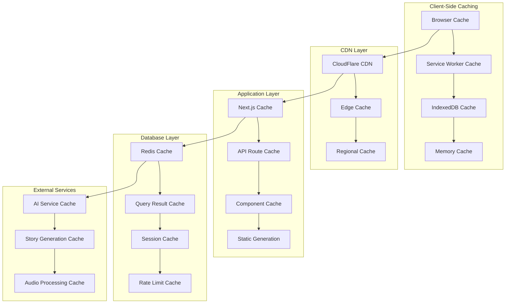
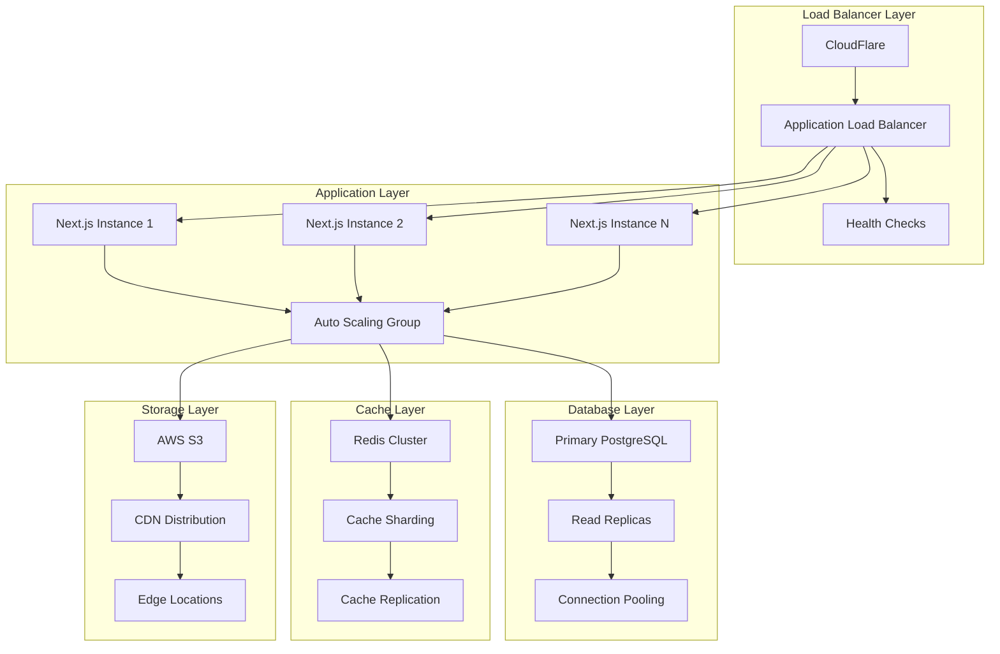

# Performance Optimization Guide

## Overview

This comprehensive guide covers performance optimization strategies for the EdTech platform, including monitoring, caching, database optimization, and frontend performance techniques. The platform is built with Next.js 15 and uses a multi-tenant architecture with complex learning analytics.

## Table of Contents

1. [Performance Monitoring and Observability](#performance-monitoring-and-observability)
2. [Caching Strategies and Implementation](#caching-strategies-and-implementation)
3. [Database Optimization Techniques](#database-optimization-techniques)
4. [Frontend Performance Optimization](#frontend-performance-optimization)
5. [Infrastructure and Scaling Strategies](#infrastructure-and-scaling-strategies)
6. [Performance Testing and Benchmarking](#performance-testing-and-benchmarking)

## Performance Monitoring and Observability

### Core Web Vitals Monitoring

The platform implements comprehensive monitoring for Core Web Vitals to ensure optimal user experience:

```typescript
// lib/performance-monitoring.ts
export class PerformanceMonitor {
  private static instance: PerformanceMonitor;
  private metrics: Map<string, number> = new Map();

  static getInstance(): PerformanceMonitor {
    if (!PerformanceMonitor.instance) {
      PerformanceMonitor.instance = new PerformanceMonitor();
    }
    return PerformanceMonitor.instance;
  }

  // Monitor Core Web Vitals
  initCoreWebVitals() {
    // First Contentful Paint (FCP)
    new PerformanceObserver((list) => {
      for (const entry of list.getEntries()) {
        if (entry.name === "first-contentful-paint") {
          this.recordMetric("FCP", entry.startTime);
        }
      }
    }).observe({ entryTypes: ["paint"] });

    // Largest Contentful Paint (LCP)
    new PerformanceObserver((list) => {
      const entries = list.getEntries();
      const lastEntry = entries[entries.length - 1];
      this.recordMetric("LCP", lastEntry.startTime);
    }).observe({ entryTypes: ["largest-contentful-paint"] });

    // Cumulative Layout Shift (CLS)
    let clsValue = 0;
    new PerformanceObserver((list) => {
      for (const entry of list.getEntries()) {
        if (!entry.hadRecentInput) {
          clsValue += entry.value;
        }
      }
      this.recordMetric("CLS", clsValue);
    }).observe({ entryTypes: ["layout-shift"] });

    // First Input Delay (FID)
    new PerformanceObserver((list) => {
      for (const entry of list.getEntries()) {
        this.recordMetric("FID", entry.processingStart - entry.startTime);
      }
    }).observe({ entryTypes: ["first-input"] });
  }

  // Record custom metrics
  recordMetric(name: string, value: number) {
    this.metrics.set(name, value);

    // Send to analytics service
    this.sendToAnalytics(name, value);
  }

  private sendToAnalytics(name: string, value: number) {
    // Implementation for sending metrics to monitoring service
    if (typeof window !== "undefined" && window.gtag) {
      window.gtag("event", "performance_metric", {
        metric_name: name,
        metric_value: value,
        page_path: window.location.pathname,
      });
    }
  }
}
```

### Real-time Performance Dashboard

```typescript
// components/admin/PerformanceDashboard.tsx
export function PerformanceDashboard() {
  const [metrics, setMetrics] = useState<PerformanceMetrics>({});
  const [alerts, setAlerts] = useState<PerformanceAlert[]>([]);

  useEffect(() => {
    const monitor = PerformanceMonitor.getInstance();

    // Real-time metrics updates
    const interval = setInterval(async () => {
      const currentMetrics = await fetchPerformanceMetrics();
      setMetrics(currentMetrics);

      // Check for performance alerts
      const newAlerts = checkPerformanceThresholds(currentMetrics);
      setAlerts(newAlerts);
    }, 30000); // Update every 30 seconds

    return () => clearInterval(interval);
  }, []);

  return (
    <div className="performance-dashboard">
      <div className="metrics-grid">
        <MetricCard
          title="Core Web Vitals"
          metrics={[
            { name: 'FCP', value: metrics.fcp, threshold: 1800 },
            { name: 'LCP', value: metrics.lcp, threshold: 2500 },
            { name: 'CLS', value: metrics.cls, threshold: 0.1 },
            { name: 'FID', value: metrics.fid, threshold: 100 },
          ]}
        />

        <MetricCard
          title="API Performance"
          metrics={[
            { name: 'Avg Response Time', value: metrics.apiResponseTime, threshold: 200 },
            { name: 'Error Rate', value: metrics.errorRate, threshold: 1 },
            { name: 'Throughput', value: metrics.throughput, threshold: 1000 },
          ]}
        />

        <MetricCard
          title="Database Performance"
          metrics={[
            { name: 'Query Time', value: metrics.dbQueryTime, threshold: 100 },
            { name: 'Connection Pool', value: metrics.dbConnections, threshold: 80 },
            { name: 'Cache Hit Rate', value: metrics.cacheHitRate, threshold: 90 },
          ]}
        />
      </div>

      {alerts.length > 0 && (
        <AlertPanel alerts={alerts} onDismiss={dismissAlert} />
      )}
    </div>
  );
}
```

### Application Performance Monitoring (APM)

```typescript
// lib/apm.ts
export class APMService {
  private static instance: APMService;
  private transactions: Map<string, Transaction> = new Map();

  static getInstance(): APMService {
    if (!APMService.instance) {
      APMService.instance = new APMService();
    }
    return APMService.instance;
  }

  // Start transaction tracking
  startTransaction(name: string, type: string = "request"): string {
    const transactionId = generateId();
    const transaction: Transaction = {
      id: transactionId,
      name,
      type,
      startTime: performance.now(),
      spans: [],
    };

    this.transactions.set(transactionId, transaction);
    return transactionId;
  }

  // Add span to transaction
  addSpan(transactionId: string, name: string, type: string): string {
    const transaction = this.transactions.get(transactionId);
    if (!transaction) return "";

    const spanId = generateId();
    const span: Span = {
      id: spanId,
      name,
      type,
      startTime: performance.now(),
    };

    transaction.spans.push(span);
    return spanId;
  }

  // End span
  endSpan(transactionId: string, spanId: string) {
    const transaction = this.transactions.get(transactionId);
    if (!transaction) return;

    const span = transaction.spans.find((s) => s.id === spanId);
    if (span) {
      span.endTime = performance.now();
      span.duration = span.endTime - span.startTime;
    }
  }

  // End transaction
  endTransaction(transactionId: string) {
    const transaction = this.transactions.get(transactionId);
    if (!transaction) return;

    transaction.endTime = performance.now();
    transaction.duration = transaction.endTime - transaction.startTime;

    // Send to APM service
    this.sendTransaction(transaction);
    this.transactions.delete(transactionId);
  }

  private sendTransaction(transaction: Transaction) {
    // Send to monitoring service (e.g., Elastic APM, New Relic, etc.)
    fetch("/api/monitoring/transactions", {
      method: "POST",
      headers: { "Content-Type": "application/json" },
      body: JSON.stringify(transaction),
    }).catch(console.error);
  }
}
```

## Caching Strategies and Implementation

### Multi-Layer Caching Architecture



### Redis Caching Implementation

```typescript
// lib/cache/redis-cache.ts
export class RedisCache {
  private client: Redis;
  private defaultTTL = 3600; // 1 hour

  constructor() {
    this.client = new Redis({
      host: process.env.REDIS_HOST,
      port: parseInt(process.env.REDIS_PORT || "6379"),
      password: process.env.REDIS_PASSWORD,
      retryDelayOnFailover: 100,
      maxRetriesPerRequest: 3,
    });
  }

  // Generic cache operations
  async get<T>(key: string): Promise<T | null> {
    try {
      const value = await this.client.get(key);
      return value ? JSON.parse(value) : null;
    } catch (error) {
      console.error("Redis get error:", error);
      return null;
    }
  }

  async set<T>(
    key: string,
    value: T,
    ttl: number = this.defaultTTL
  ): Promise<boolean> {
    try {
      await this.client.setex(key, ttl, JSON.stringify(value));
      return true;
    } catch (error) {
      console.error("Redis set error:", error);
      return false;
    }
  }

  async del(key: string): Promise<boolean> {
    try {
      await this.client.del(key);
      return true;
    } catch (error) {
      console.error("Redis del error:", error);
      return false;
    }
  }

  // Story-specific caching
  async cacheStory(
    storyId: string,
    story: Story,
    ttl: number = 7200
  ): Promise<void> {
    const key = `story:${storyId}`;
    await this.set(key, story, ttl);

    // Cache story metadata separately for quick access
    const metaKey = `story:meta:${storyId}`;
    const metadata = {
      id: story.id,
      title: story.title,
      level: story.level,
      duration: story.estimatedDuration,
      lastUpdated: story.updatedAt,
    };
    await this.set(metaKey, metadata, ttl);
  }

  async getStory(storyId: string): Promise<Story | null> {
    const key = `story:${storyId}`;
    return await this.get<Story>(key);
  }

  // User progress caching
  async cacheUserProgress(
    userId: string,
    progress: UserProgress
  ): Promise<void> {
    const key = `progress:${userId}`;
    await this.set(key, progress, 1800); // 30 minutes TTL
  }

  async getUserProgress(userId: string): Promise<UserProgress | null> {
    const key = `progress:${userId}`;
    return await this.get<UserProgress>(key);
  }

  // Vocabulary caching with frequency-based TTL
  async cacheVocabulary(word: string, data: VocabularyData): Promise<void> {
    const frequency = data.frequency || 1;
    const ttl = Math.min(86400, 3600 * frequency); // Max 24 hours, min 1 hour

    const key = `vocab:${word.toLowerCase()}`;
    await this.set(key, data, ttl);
  }

  // Cache invalidation patterns
  async invalidateUserCache(userId: string): Promise<void> {
    const pattern = `*:${userId}:*`;
    const keys = await this.client.keys(pattern);

    if (keys.length > 0) {
      await this.client.del(...keys);
    }
  }

  async invalidateStoryCache(storyId: string): Promise<void> {
    const keys = [
      `story:${storyId}`,
      `story:meta:${storyId}`,
      `exercises:${storyId}`,
    ];

    await this.client.del(...keys);
  }
}
```

### Next.js Caching Strategies

```typescript
// lib/cache/nextjs-cache.ts
export const cacheConfig = {
  // Static page caching
  staticPages: {
    revalidate: 3600, // 1 hour
    tags: ["static-content"],
  },

  // API route caching
  apiRoutes: {
    stories: {
      revalidate: 1800, // 30 minutes
      tags: ["stories"],
    },
    userProgress: {
      revalidate: 300, // 5 minutes
      tags: ["progress"],
    },
    vocabulary: {
      revalidate: 86400, // 24 hours
      tags: ["vocabulary"],
    },
  },

  // Component-level caching
  components: {
    storyList: {
      revalidate: 900, // 15 minutes
      tags: ["stories", "user-specific"],
    },
    progressChart: {
      revalidate: 600, // 10 minutes
      tags: ["progress", "analytics"],
    },
  },
};

// Cache utility functions
export async function getCachedStories(userId: string): Promise<Story[]> {
  return unstable_cache(
    async () => {
      const stories = await prisma.story.findMany({
        where: {
          tenantId: await getUserTenantId(userId),
          published: true,
        },
        include: {
          vocabulary: true,
          exercises: true,
        },
      });
      return stories;
    },
    [`stories-${userId}`],
    {
      revalidate: cacheConfig.apiRoutes.stories.revalidate,
      tags: cacheConfig.apiRoutes.stories.tags,
    }
  )();
}

export async function getCachedUserProgress(
  userId: string
): Promise<UserProgress> {
  return unstable_cache(
    async () => {
      const progress = await prisma.progress.findMany({
        where: { userId },
        include: {
          story: true,
          vocabularyProgress: true,
        },
      });
      return aggregateProgress(progress);
    },
    [`progress-${userId}`],
    {
      revalidate: cacheConfig.apiRoutes.userProgress.revalidate,
      tags: cacheConfig.apiRoutes.userProgress.tags,
    }
  )();
}
```

### Client-Side Caching with TanStack Query

```typescript
// lib/cache/query-cache.ts
export const queryClient = new QueryClient({
  defaultOptions: {
    queries: {
      // Global cache settings
      staleTime: 5 * 60 * 1000, // 5 minutes
      gcTime: 10 * 60 * 1000, // 10 minutes (formerly cacheTime)
      retry: (failureCount, error) => {
        // Don't retry on 4xx errors
        if (error instanceof Error && error.message.includes("4")) {
          return false;
        }
        return failureCount < 3;
      },
      retryDelay: (attemptIndex) => Math.min(1000 * 2 ** attemptIndex, 30000),
    },
    mutations: {
      retry: 1,
      onError: (error) => {
        console.error("Mutation error:", error);
        // Show user-friendly error message
        toast.error("Something went wrong. Please try again.");
      },
    },
  },
});

// Query key factory for consistent caching
export const queryKeys = {
  stories: {
    all: ["stories"] as const,
    lists: () => [...queryKeys.stories.all, "list"] as const,
    list: (filters: StoryFilters) =>
      [...queryKeys.stories.lists(), filters] as const,
    details: () => [...queryKeys.stories.all, "detail"] as const,
    detail: (id: string) => [...queryKeys.stories.details(), id] as const,
  },
  progress: {
    all: ["progress"] as const,
    user: (userId: string) =>
      [...queryKeys.progress.all, "user", userId] as const,
    story: (storyId: string) =>
      [...queryKeys.progress.all, "story", storyId] as const,
  },
  vocabulary: {
    all: ["vocabulary"] as const,
    word: (word: string) =>
      [...queryKeys.vocabulary.all, "word", word] as const,
    userProgress: (userId: string) =>
      [...queryKeys.vocabulary.all, "progress", userId] as const,
  },
};

// Optimistic updates for better UX
export function useOptimisticProgress() {
  const queryClient = useQueryClient();

  return useMutation({
    mutationFn: updateProgress,
    onMutate: async (newProgress) => {
      // Cancel outgoing refetches
      await queryClient.cancelQueries({
        queryKey: queryKeys.progress.user(newProgress.userId),
      });

      // Snapshot previous value
      const previousProgress = queryClient.getQueryData(
        queryKeys.progress.user(newProgress.userId)
      );

      // Optimistically update
      queryClient.setQueryData(
        queryKeys.progress.user(newProgress.userId),
        (old: UserProgress) => ({
          ...old,
          ...newProgress,
        })
      );

      return { previousProgress };
    },
    onError: (err, newProgress, context) => {
      // Rollback on error
      queryClient.setQueryData(
        queryKeys.progress.user(newProgress.userId),
        context?.previousProgress
      );
    },
    onSettled: (data, error, variables) => {
      // Always refetch after error or success
      queryClient.invalidateQueries({
        queryKey: queryKeys.progress.user(variables.userId),
      });
    },
  });
}
```

## Database Optimization Techniques

### Indexing Strategies

```sql
-- Core indexes for performance-critical queries

-- User-related indexes
CREATE INDEX CONCURRENTLY idx_users_tenant_email ON users(tenant_id, email);
CREATE INDEX CONCURRENTLY idx_users_tenant_active ON users(tenant_id, is_active) WHERE is_active = true;
CREATE INDEX CONCURRENTLY idx_users_created_at ON users(created_at DESC);

-- Story-related indexes
CREATE INDEX CONCURRENTLY idx_stories_tenant_published ON stories(tenant_id, published) WHERE published = true;
CREATE INDEX CONCURRENTLY idx_stories_level_difficulty ON stories(level, difficulty_score);
CREATE INDEX CONCURRENTLY idx_stories_created_at ON stories(created_at DESC);
CREATE INDEX CONCURRENTLY idx_stories_title_search ON stories USING gin(to_tsvector('english', title));

-- Progress tracking indexes
CREATE INDEX CONCURRENTLY idx_progress_user_story ON progress(user_id, story_id);
CREATE INDEX CONCURRENTLY idx_progress_user_updated ON progress(user_id, updated_at DESC);
CREATE INDEX CONCURRENTLY idx_progress_completion ON progress(completion_percentage) WHERE completion_percentage >= 80;

-- Vocabulary indexes
CREATE INDEX CONCURRENTLY idx_vocabulary_word_level ON vocabulary(word, difficulty_level);
CREATE INDEX CONCURRENTLY idx_vocabulary_frequency ON vocabulary(frequency DESC);
CREATE INDEX CONCURRENTLY idx_vocabulary_search ON vocabulary USING gin(to_tsvector('english', word || ' ' || definition));

-- User vocabulary progress indexes
CREATE INDEX CONCURRENTLY idx_user_vocab_progress ON user_vocabulary_progress(user_id, vocabulary_id);
CREATE INDEX CONCURRENTLY idx_user_vocab_mastery ON user_vocabulary_progress(user_id, mastery_level) WHERE mastery_level >= 0.8;
CREATE INDEX CONCURRENTLY idx_user_vocab_last_reviewed ON user_vocabulary_progress(user_id, last_reviewed DESC);

-- Exercise-related indexes
CREATE INDEX CONCURRENTLY idx_exercises_story_type ON exercises(story_id, exercise_type);
CREATE INDEX CONCURRENTLY idx_exercise_attempts_user ON exercise_attempts(user_id, created_at DESC);
CREATE INDEX CONCURRENTLY idx_exercise_attempts_success ON exercise_attempts(user_id, is_correct, created_at DESC);

-- Analytics indexes
CREATE INDEX CONCURRENTLY idx_learning_sessions_user_date ON learning_sessions(user_id, started_at DESC);
CREATE INDEX CONCURRENTLY idx_learning_sessions_duration ON learning_sessions(duration_minutes) WHERE duration_minutes > 0;
CREATE INDEX CONCURRENTLY idx_user_events_type_date ON user_events(user_id, event_type, created_at DESC);

-- Composite indexes for complex queries
CREATE INDEX CONCURRENTLY idx_stories_tenant_level_published ON stories(tenant_id, level, published) WHERE published = true;
CREATE INDEX CONCURRENTLY idx_progress_user_completion_date ON progress(user_id, completion_percentage, updated_at DESC);
CREATE INDEX CONCURRENTLY idx_vocab_progress_user_mastery_reviewed ON user_vocabulary_progress(user_id, mastery_level, last_reviewed DESC);
```

### Query Optimization Patterns

```typescript
// lib/database/optimized-queries.ts
export class OptimizedQueries {
  private prisma: PrismaClient;

  constructor(prisma: PrismaClient) {
    this.prisma = prisma;
  }

  // Optimized story fetching with selective loading
  async getStoriesForUser(userId: string, options: StoryQueryOptions = {}) {
    const { level, limit = 20, offset = 0, includeProgress = false } = options;

    // Use raw query for complex filtering with proper indexes
    const baseQuery = `
      SELECT 
        s.id,
        s.title,
        s.level,
        s.difficulty_score,
        s.estimated_duration,
        s.thumbnail_url,
        s.created_at,
        ${
          includeProgress
            ? `
        p.completion_percentage,
        p.time_spent,
        p.last_accessed
        `
            : "NULL as completion_percentage, NULL as time_spent, NULL as last_accessed"
        }
      FROM stories s
      ${
        includeProgress
          ? `
      LEFT JOIN progress p ON s.id = p.story_id AND p.user_id = $1
      `
          : ""
      }
      WHERE s.tenant_id = (SELECT tenant_id FROM users WHERE id = $1)
        AND s.published = true
        ${level ? "AND s.level = $2" : ""}
      ORDER BY 
        ${includeProgress ? "p.last_accessed DESC NULLS LAST," : ""}
        s.created_at DESC
      LIMIT $${level ? "3" : "2"} OFFSET $${level ? "4" : "3"}
    `;

    const params = level
      ? [userId, level, limit, offset]
      : [userId, limit, offset];

    return await this.prisma.$queryRaw`${baseQuery}`.bind(null, ...params);
  }

  // Optimized progress aggregation
  async getUserProgressSummary(userId: string): Promise<ProgressSummary> {
    // Use a single query with aggregations instead of multiple queries
    const result = await this.prisma.$queryRaw<ProgressSummary[]>`
      SELECT 
        COUNT(DISTINCT p.story_id) as stories_started,
        COUNT(DISTINCT CASE WHEN p.completion_percentage >= 100 THEN p.story_id END) as stories_completed,
        AVG(p.completion_percentage) as avg_completion,
        SUM(p.time_spent) as total_time_spent,
        COUNT(DISTINCT uvp.vocabulary_id) as vocabulary_learned,
        AVG(uvp.mastery_level) as avg_vocabulary_mastery,
        COUNT(DISTINCT DATE(p.updated_at)) as active_days_last_30
      FROM progress p
      LEFT JOIN user_vocabulary_progress uvp ON p.user_id = uvp.user_id
      WHERE p.user_id = ${userId}
        AND p.updated_at >= NOW() - INTERVAL '30 days'
    `;

    return result[0];
  }

  // Optimized vocabulary recommendations
  async getVocabularyRecommendations(
    userId: string,
    limit: number = 10
  ): Promise<Vocabulary[]> {
    // Complex query optimized with proper indexes
    return await this.prisma.$queryRaw`
      WITH user_level AS (
        SELECT 
          COALESCE(AVG(s.difficulty_score), 1.0) as avg_difficulty
        FROM progress p
        JOIN stories s ON p.story_id = s.id
        WHERE p.user_id = ${userId}
          AND p.completion_percentage > 50
      ),
      vocabulary_scores AS (
        SELECT 
          v.*,
          COALESCE(uvp.mastery_level, 0) as current_mastery,
          CASE 
            WHEN uvp.last_reviewed IS NULL THEN 1.0
            WHEN uvp.last_reviewed < NOW() - INTERVAL '7 days' THEN 0.8
            WHEN uvp.last_reviewed < NOW() - INTERVAL '3 days' THEN 0.6
            ELSE 0.3
          END as review_urgency,
          ABS(v.difficulty_level - (SELECT avg_difficulty FROM user_level)) as difficulty_match
        FROM vocabulary v
        LEFT JOIN user_vocabulary_progress uvp ON v.id = uvp.vocabulary_id AND uvp.user_id = ${userId}
        WHERE v.difficulty_level <= (SELECT avg_difficulty FROM user_level) + 0.5
      )
      SELECT *
      FROM vocabulary_scores
      WHERE current_mastery < 0.8
      ORDER BY 
        review_urgency DESC,
        difficulty_match ASC,
        frequency DESC
      LIMIT ${limit}
    `;
  }

  // Batch operations for better performance
  async batchUpdateProgress(progressUpdates: ProgressUpdate[]): Promise<void> {
    // Use transaction with batch operations
    await this.prisma.$transaction(async (tx) => {
      // Prepare batch insert/update
      const values = progressUpdates
        .map(
          (update) =>
            `(${update.userId}, ${update.storyId}, ${update.completionPercentage}, ${update.timeSpent}, NOW())`
        )
        .join(",");

      await tx.$executeRaw`
        INSERT INTO progress (user_id, story_id, completion_percentage, time_spent, updated_at)
        VALUES ${values}
        ON CONFLICT (user_id, story_id)
        DO UPDATE SET
          completion_percentage = GREATEST(progress.completion_percentage, EXCLUDED.completion_percentage),
          time_spent = progress.time_spent + EXCLUDED.time_spent,
          updated_at = EXCLUDED.updated_at
      `;
    });
  }
}
```

### Connection Pool Optimization

```typescript
// lib/database/connection-pool.ts
export const databaseConfig = {
  // Connection pool settings
  datasources: {
    db: {
      url: process.env.DATABASE_URL,
    },
  },

  // Prisma Client configuration
  generator: {
    client: {
      provider: "prisma-client-js",
      previewFeatures: ["jsonProtocol", "metrics"],
    },
  },

  // Connection pool optimization
  connectionPool: {
    // Maximum number of connections in the pool
    maxConnections: parseInt(process.env.DB_MAX_CONNECTIONS || "20"),

    // Minimum number of connections to maintain
    minConnections: parseInt(process.env.DB_MIN_CONNECTIONS || "5"),

    // Connection timeout in milliseconds
    connectionTimeout: parseInt(process.env.DB_CONNECTION_TIMEOUT || "10000"),

    // Query timeout in milliseconds
    queryTimeout: parseInt(process.env.DB_QUERY_TIMEOUT || "30000"),

    // Connection idle timeout
    idleTimeout: parseInt(process.env.DB_IDLE_TIMEOUT || "300000"),
  },
};

// Connection pool monitoring
export class ConnectionPoolMonitor {
  private prisma: PrismaClient;
  private metrics: Map<string, number> = new Map();

  constructor(prisma: PrismaClient) {
    this.prisma = prisma;
    this.startMonitoring();
  }

  private startMonitoring() {
    setInterval(async () => {
      try {
        // Get connection pool metrics
        const metrics = await this.prisma.$metrics.json();

        this.metrics.set(
          "activeConnections",
          metrics.counters.find((c) => c.key === "db.connections.active")
            ?.value || 0
        );
        this.metrics.set(
          "idleConnections",
          metrics.counters.find((c) => c.key === "db.connections.idle")
            ?.value || 0
        );
        this.metrics.set(
          "totalConnections",
          metrics.counters.find((c) => c.key === "db.connections.total")
            ?.value || 0
        );

        // Query performance metrics
        const avgQueryTime =
          metrics.histograms.find((h) => h.key === "db.query.duration")?.value
            .mean || 0;
        this.metrics.set("avgQueryTime", avgQueryTime);

        // Check for alerts
        this.checkConnectionPoolAlerts();
      } catch (error) {
        console.error("Connection pool monitoring error:", error);
      }
    }, 30000); // Check every 30 seconds
  }

  private checkConnectionPoolAlerts() {
    const activeConnections = this.metrics.get("activeConnections") || 0;
    const totalConnections = this.metrics.get("totalConnections") || 0;
    const avgQueryTime = this.metrics.get("avgQueryTime") || 0;

    // Alert if connection pool is near capacity
    if (activeConnections / totalConnections > 0.8) {
      console.warn("Connection pool usage high:", {
        active: activeConnections,
        total: totalConnections,
        usage: ((activeConnections / totalConnections) * 100).toFixed(1) + "%",
      });
    }

    // Alert if queries are slow
    if (avgQueryTime > 1000) {
      // 1 second
      console.warn("Database queries are slow:", {
        avgQueryTime: avgQueryTime.toFixed(2) + "ms",
      });
    }
  }

  getMetrics() {
    return Object.fromEntries(this.metrics);
  }
}
```

## Frontend Performance Optimization

### Code Splitting and Lazy Loading

```typescript
// components/LazyComponents.tsx
import { lazy, Suspense } from 'react';
import { LoadingSpinner } from '@/components/ui/loading-spinner';

// Lazy load heavy components
const StoryReader = lazy(() => import('./learning/StoryReader'));
const AudioPlayer = lazy(() => import('./learning/AudioPlayer'));
const ExercisePanel = lazy(() => import('./learning/ExercisePanel'));
const AnalyticsDashboard = lazy(() => import('./admin/AnalyticsDashboard'));

// Route-based code splitting
const AdminRoutes = lazy(() => import('./admin/AdminRoutes'));
const LearningRoutes = lazy(() => import('./learning/LearningRoutes'));

// Component wrapper with error boundary
export function LazyComponent({
  component: Component,
  fallback = <LoadingSpinner />,
  ...props
}) {
  return (
    <Suspense fallback={fallback}>
      <ErrorBoundary>
        <Component {...props} />
      </ErrorBoundary>
    </Suspense>
  );
}

// Dynamic imports with preloading
export const preloadComponents = {
  storyReader: () => import('./learning/StoryReader'),
  audioPlayer: () => import('./learning/AudioPlayer'),
  exercisePanel: () => import('./learning/ExercisePanel'),
};

// Preload on user interaction
export function useComponentPreloader() {
  const preloadComponent = useCallback((componentName: keyof typeof preloadComponents) => {
    preloadComponents[componentName]();
  }, []);

  return { preloadComponent };
}
```

### Bundle Optimization

```typescript
// next.config.ts
const nextConfig = {
  // Bundle optimization
  webpack: (config, { buildId, dev, isServer, defaultLoaders, webpack }) => {
    // Bundle analyzer in development
    if (!dev && !isServer) {
      config.plugins.push(
        new (require("webpack-bundle-analyzer").BundleAnalyzerPlugin)({
          analyzerMode: "static",
          openAnalyzer: false,
          reportFilename: "bundle-analyzer-report.html",
        })
      );
    }

    // Optimize chunks
    config.optimization = {
      ...config.optimization,
      splitChunks: {
        chunks: "all",
        cacheGroups: {
          // Vendor chunk for stable dependencies
          vendor: {
            test: /[\\/]node_modules[\\/]/,
            name: "vendors",
            chunks: "all",
            priority: 10,
          },
          // Common chunk for shared components
          common: {
            name: "common",
            minChunks: 2,
            chunks: "all",
            priority: 5,
            reuseExistingChunk: true,
          },
          // Learning module chunk
          learning: {
            test: /[\\/]src[\\/](app[\\/]learning|components[\\/]learning)[\\/]/,
            name: "learning",
            chunks: "all",
            priority: 8,
          },
          // Admin module chunk
          admin: {
            test: /[\\/]src[\\/](app[\\/]admin|components[\\/]admin)[\\/]/,
            name: "admin",
            chunks: "all",
            priority: 8,
          },
        },
      },
    };

    // Tree shaking optimization
    config.optimization.usedExports = true;
    config.optimization.sideEffects = false;

    return config;
  },

  // Compression
  compress: true,

  // Image optimization
  images: {
    domains: ["cdn.example.com", "s3.amazonaws.com"],
    formats: ["image/webp", "image/avif"],
    minimumCacheTTL: 86400, // 24 hours
    dangerouslyAllowSVG: true,
    contentSecurityPolicy: "default-src 'self'; script-src 'none'; sandbox;",
  },

  // Experimental features for performance
  experimental: {
    optimizeCss: true,
    optimizePackageImports: ["@/components", "@/lib", "@/hooks"],
    turbo: {
      rules: {
        "*.svg": {
          loaders: ["@svgr/webpack"],
          as: "*.js",
        },
      },
    },
  },

  // Static optimization
  trailingSlash: false,
  generateEtags: true,
  poweredByHeader: false,

  // Headers for caching
  async headers() {
    return [
      {
        source: "/api/:path*",
        headers: [
          {
            key: "Cache-Control",
            value: "public, max-age=300, stale-while-revalidate=600",
          },
        ],
      },
      {
        source: "/_next/static/:path*",
        headers: [
          {
            key: "Cache-Control",
            value: "public, max-age=31536000, immutable",
          },
        ],
      },
    ];
  },
};

export default nextConfig;
```

### Image and Asset Optimization

```typescript
// components/OptimizedImage.tsx
import Image from 'next/image';
import { useState } from 'react';

interface OptimizedImageProps {
  src: string;
  alt: string;
  width?: number;
  height?: number;
  priority?: boolean;
  className?: string;
  sizes?: string;
}

export function OptimizedImage({
  src,
  alt,
  width,
  height,
  priority = false,
  className,
  sizes = '(max-width: 768px) 100vw, (max-width: 1200px) 50vw, 33vw',
}: OptimizedImageProps) {
  const [isLoading, setIsLoading] = useState(true);
  const [hasError, setHasError] = useState(false);

  return (
    <div className={`relative overflow-hidden ${className}`}>
      {isLoading && (
        <div className="absolute inset-0 bg-gray-200 animate-pulse" />
      )}

      {hasError ? (
        <div className="flex items-center justify-center h-full bg-gray-100">
          <span className="text-gray-500">Failed to load image</span>
        </div>
      ) : (
        <Image
          src={src}
          alt={alt}
          width={width}
          height={height}
          priority={priority}
          sizes={sizes}
          className={`transition-opacity duration-300 ${
            isLoading ? 'opacity-0' : 'opacity-100'
          }`}
          onLoad={() => setIsLoading(false)}
          onError={() => {
            setIsLoading(false);
            setHasError(true);
          }}
          // Performance optimizations
          quality={85}
          placeholder="blur"
          blurDataURL="data:image/jpeg;base64,/9j/4AAQSkZJRgABAQAAAQABAAD/2wBDAAYEBQYFBAYGBQYHBwYIChAKCgkJChQODwwQFxQYGBcUFhYaHSUfGhsjHBYWICwgIyYnKSopGR8tMC0oMCUoKSj/2wBDAQcHBwoIChMKChMoGhYaKCgoKCgoKCgoKCgoKCgoKCgoKCgoKCgoKCgoKCgoKCgoKCgoKCgoKCgoKCgoKCgoKCj/wAARCAAIAAoDASIAAhEBAxEB/8QAFQABAQAAAAAAAAAAAAAAAAAAAAv/xAAhEAACAQMDBQAAAAAAAAAAAAABAgMABAUGIWGRkqGx0f/EABUBAQEAAAAAAAAAAAAAAAAAAAMF/8QAGhEAAgIDAAAAAAAAAAAAAAAAAAECEgMRkf/aAAwDAQACEQMRAD8AltJagyeH0AthI5xdrLcNM91BF5pX2HaH9bcfaSXWGaRmknyJckliyjqTzSlT54b6bk+h0R//2Q=="
        />
      )}
    </div>
  );
}

// Asset preloading utility
export function useAssetPreloader() {
  const preloadImage = useCallback((src: string) => {
    const link = document.createElement('link');
    link.rel = 'preload';
    link.as = 'image';
    link.href = src;
    document.head.appendChild(link);
  }, []);

  const preloadAudio = useCallback((src: string) => {
    const audio = new Audio();
    audio.preload = 'metadata';
    audio.src = src;
  }, []);

  const preloadFont = useCallback((href: string) => {
    const link = document.createElement('link');
    link.rel = 'preload';
    link.as = 'font';
    link.type = 'font/woff2';
    link.crossOrigin = 'anonymous';
    link.href = href;
    document.head.appendChild(link);
  }, []);

  return { preloadImage, preloadAudio, preloadFont };
}
```

### Virtual Scrolling for Large Lists

```typescript
// components/VirtualizedList.tsx
import { FixedSizeList as List } from 'react-window';
import { useMemo, useCallback } from 'react';

interface VirtualizedListProps<T> {
  items: T[];
  height: number;
  itemHeight: number;
  renderItem: (item: T, index: number) => React.ReactNode;
  className?: string;
}

export function VirtualizedList<T>({
  items,
  height,
  itemHeight,
  renderItem,
  className,
}: VirtualizedListProps<T>) {
  const Row = useCallback(({ index, style }) => (
    <div style={style}>
      {renderItem(items[index], index)}
    </div>
  ), [items, renderItem]);

  return (
    <List
      className={className}
      height={height}
      itemCount={items.length}
      itemSize={itemHeight}
      overscanCount={5} // Render 5 extra items for smooth scrolling
    >
      {Row}
    </List>
  );
}

// Usage example for story list
export function StoryListVirtualized({ stories }: { stories: Story[] }) {
  const renderStoryItem = useCallback((story: Story, index: number) => (
    <StoryCard key={story.id} story={story} />
  ), []);

  return (
    <VirtualizedList
      items={stories}
      height={600}
      itemHeight={120}
      renderItem={renderStoryItem}
      className="story-list"
    />
  );
}
```

### Performance Monitoring Hooks

```typescript
// hooks/usePerformanceMonitoring.ts
export function usePerformanceMonitoring(componentName: string) {
  const renderStartTime = useRef<number>();
  const [renderTime, setRenderTime] = useState<number>(0);

  useEffect(() => {
    renderStartTime.current = performance.now();
  });

  useLayoutEffect(() => {
    if (renderStartTime.current) {
      const renderDuration = performance.now() - renderStartTime.current;
      setRenderTime(renderDuration);

      // Log slow renders
      if (renderDuration > 16) {
        // More than one frame at 60fps
        console.warn(`Slow render detected in ${componentName}:`, {
          duration: renderDuration.toFixed(2) + "ms",
          component: componentName,
        });
      }
    }
  });

  return { renderTime };
}

// Memory usage monitoring
export function useMemoryMonitoring() {
  const [memoryInfo, setMemoryInfo] = useState<MemoryInfo | null>(null);

  useEffect(() => {
    const updateMemoryInfo = () => {
      if ("memory" in performance) {
        setMemoryInfo({
          usedJSHeapSize: (performance as any).memory.usedJSHeapSize,
          totalJSHeapSize: (performance as any).memory.totalJSHeapSize,
          jsHeapSizeLimit: (performance as any).memory.jsHeapSizeLimit,
        });
      }
    };

    updateMemoryInfo();
    const interval = setInterval(updateMemoryInfo, 5000);

    return () => clearInterval(interval);
  }, []);

  return memoryInfo;
}

// Component re-render tracking
export function useRenderTracking(componentName: string, props: any) {
  const renderCount = useRef(0);
  const prevProps = useRef(props);

  renderCount.current += 1;

  useEffect(() => {
    const changedProps = Object.keys(props).filter(
      (key) => props[key] !== prevProps.current[key]
    );

    if (changedProps.length > 0) {
      console.log(`${componentName} re-rendered due to:`, changedProps);
    }

    prevProps.current = props;
  });

  // Log excessive re-renders
  useEffect(() => {
    if (renderCount.current > 10) {
      console.warn(
        `${componentName} has rendered ${renderCount.current} times`
      );
    }
  });

  return renderCount.current;
}
```

### Service Worker for Caching

```javascript
// public/sw.js - Enhanced service worker for performance
const CACHE_NAME = "edtech-v1.2.0";
const STATIC_CACHE = "static-v1.2.0";
const DYNAMIC_CACHE = "dynamic-v1.2.0";
const AUDIO_CACHE = "audio-v1.2.0";

// Cache strategies
const CACHE_STRATEGIES = {
  CACHE_FIRST: "cache-first",
  NETWORK_FIRST: "network-first",
  STALE_WHILE_REVALIDATE: "stale-while-revalidate",
  NETWORK_ONLY: "network-only",
  CACHE_ONLY: "cache-only",
};

// Route-specific caching strategies
const ROUTE_STRATEGIES = {
  "/api/stories": CACHE_STRATEGIES.STALE_WHILE_REVALIDATE,
  "/api/progress": CACHE_STRATEGIES.NETWORK_FIRST,
  "/api/vocabulary": CACHE_STRATEGIES.CACHE_FIRST,
  "/_next/static/": CACHE_STRATEGIES.CACHE_FIRST,
  "/audio/": CACHE_STRATEGIES.CACHE_FIRST,
};

// Install event - cache static assets
self.addEventListener("install", (event) => {
  event.waitUntil(
    Promise.all([
      // Cache static assets
      caches.open(STATIC_CACHE).then((cache) => {
        return cache.addAll([
          "/",
          "/learning",
          "/manifest.json",
          "/_next/static/css/",
          "/_next/static/js/",
        ]);
      }),

      // Skip waiting to activate immediately
      self.skipWaiting(),
    ])
  );
});

// Activate event - clean up old caches
self.addEventListener("activate", (event) => {
  event.waitUntil(
    Promise.all([
      // Clean up old caches
      caches.keys().then((cacheNames) => {
        return Promise.all(
          cacheNames
            .filter(
              (cacheName) =>
                cacheName !== CACHE_NAME &&
                cacheName !== STATIC_CACHE &&
                cacheName !== DYNAMIC_CACHE &&
                cacheName !== AUDIO_CACHE
            )
            .map((cacheName) => caches.delete(cacheName))
        );
      }),

      // Take control of all clients
      self.clients.claim(),
    ])
  );
});

// Fetch event - implement caching strategies
self.addEventListener("fetch", (event) => {
  const { request } = event;
  const url = new URL(request.url);

  // Skip non-GET requests
  if (request.method !== "GET") {
    return;
  }

  // Determine caching strategy
  const strategy = getCachingStrategy(url.pathname);

  event.respondWith(handleRequest(request, strategy));
});

// Get caching strategy for a route
function getCachingStrategy(pathname) {
  for (const [route, strategy] of Object.entries(ROUTE_STRATEGIES)) {
    if (pathname.startsWith(route)) {
      return strategy;
    }
  }
  return CACHE_STRATEGIES.NETWORK_FIRST; // Default strategy
}

// Handle request based on strategy
async function handleRequest(request, strategy) {
  const url = new URL(request.url);
  const cacheName = getCacheName(url.pathname);

  switch (strategy) {
    case CACHE_STRATEGIES.CACHE_FIRST:
      return cacheFirst(request, cacheName);

    case CACHE_STRATEGIES.NETWORK_FIRST:
      return networkFirst(request, cacheName);

    case CACHE_STRATEGIES.STALE_WHILE_REVALIDATE:
      return staleWhileRevalidate(request, cacheName);

    case CACHE_STRATEGIES.NETWORK_ONLY:
      return fetch(request);

    case CACHE_STRATEGIES.CACHE_ONLY:
      return caches.match(request);

    default:
      return networkFirst(request, cacheName);
  }
}

// Cache-first strategy
async function cacheFirst(request, cacheName) {
  const cache = await caches.open(cacheName);
  const cachedResponse = await cache.match(request);

  if (cachedResponse) {
    return cachedResponse;
  }

  try {
    const networkResponse = await fetch(request);
    if (networkResponse.ok) {
      cache.put(request, networkResponse.clone());
    }
    return networkResponse;
  } catch (error) {
    console.error("Cache-first strategy failed:", error);
    throw error;
  }
}

// Network-first strategy
async function networkFirst(request, cacheName) {
  const cache = await caches.open(cacheName);

  try {
    const networkResponse = await fetch(request);
    if (networkResponse.ok) {
      cache.put(request, networkResponse.clone());
    }
    return networkResponse;
  } catch (error) {
    const cachedResponse = await cache.match(request);
    if (cachedResponse) {
      return cachedResponse;
    }
    throw error;
  }
}

// Stale-while-revalidate strategy
async function staleWhileRevalidate(request, cacheName) {
  const cache = await caches.open(cacheName);
  const cachedResponse = await cache.match(request);

  // Fetch in background to update cache
  const fetchPromise = fetch(request).then((networkResponse) => {
    if (networkResponse.ok) {
      cache.put(request, networkResponse.clone());
    }
    return networkResponse;
  });

  // Return cached response immediately if available
  return cachedResponse || fetchPromise;
}

// Get appropriate cache name
function getCacheName(pathname) {
  if (pathname.startsWith("/audio/")) {
    return AUDIO_CACHE;
  } else if (pathname.startsWith("/_next/static/")) {
    return STATIC_CACHE;
  } else {
    return DYNAMIC_CACHE;
  }
}

// Background sync for offline actions
self.addEventListener("sync", (event) => {
  if (event.tag === "progress-sync") {
    event.waitUntil(syncProgress());
  }
});

// Sync progress data when back online
async function syncProgress() {
  try {
    const cache = await caches.open("offline-actions");
    const requests = await cache.keys();

    for (const request of requests) {
      if (request.url.includes("/api/progress")) {
        try {
          await fetch(request);
          await cache.delete(request);
        } catch (error) {
          console.error("Failed to sync progress:", error);
        }
      }
    }
  } catch (error) {
    console.error("Background sync failed:", error);
  }
}
```

## Infrastructure and Scaling Strategies

### Horizontal Scaling Architecture



### Database Scaling Strategies

```typescript
// lib/database/scaling.ts
export class DatabaseScalingManager {
  private primaryDb: PrismaClient;
  private readReplicas: PrismaClient[];
  private currentReplicaIndex = 0;

  constructor() {
    this.primaryDb = new PrismaClient({
      datasources: {
        db: { url: process.env.DATABASE_PRIMARY_URL },
      },
    });

    this.readReplicas = [
      new PrismaClient({
        datasources: {
          db: { url: process.env.DATABASE_REPLICA_1_URL },
        },
      }),
      new PrismaClient({
        datasources: {
          db: { url: process.env.DATABASE_REPLICA_2_URL },
        },
      }),
    ];
  }

  // Read operations use replicas with load balancing
  getReadClient(): PrismaClient {
    const replica = this.readReplicas[this.currentReplicaIndex];
    this.currentReplicaIndex =
      (this.currentReplicaIndex + 1) % this.readReplicas.length;
    return replica;
  }

  // Write operations use primary
  getWriteClient(): PrismaClient {
    return this.primaryDb;
  }

  // Intelligent query routing
  async executeQuery<T>(
    operation: "read" | "write",
    query: (client: PrismaClient) => Promise<T>
  ): Promise<T> {
    const client =
      operation === "read" ? this.getReadClient() : this.getWriteClient();

    try {
      return await query(client);
    } catch (error) {
      // Fallback to primary for read operations if replica fails
      if (operation === "read") {
        console.warn("Read replica failed, falling back to primary:", error);
        return await query(this.primaryDb);
      }
      throw error;
    }
  }

  // Database sharding for large datasets
  getShardedClient(tenantId: string): PrismaClient {
    const shardIndex = this.getShardIndex(tenantId);
    const shardUrl = process.env[`DATABASE_SHARD_${shardIndex}_URL`];

    return new PrismaClient({
      datasources: {
        db: { url: shardUrl },
      },
    });
  }

  private getShardIndex(tenantId: string): number {
    // Simple hash-based sharding
    const hash = tenantId
      .split("")
      .reduce((acc, char) => acc + char.charCodeAt(0), 0);
    return hash % parseInt(process.env.DATABASE_SHARD_COUNT || "4");
  }
}
```

### Auto-scaling Configuration

```yaml
# infrastructure/auto-scaling.yml
apiVersion: autoscaling/v2
kind: HorizontalPodAutoscaler
metadata:
  name: edtech-app-hpa
spec:
  scaleTargetRef:
    apiVersion: apps/v1
    kind: Deployment
    name: edtech-app
  minReplicas: 3
  maxReplicas: 20
  metrics:
    - type: Resource
      resource:
        name: cpu
        target:
          type: Utilization
          averageUtilization: 70
    - type: Resource
      resource:
        name: memory
        target:
          type: Utilization
          averageUtilization: 80
    - type: Pods
      pods:
        metric:
          name: http_requests_per_second
        target:
          type: AverageValue
          averageValue: "100"
  behavior:
    scaleUp:
      stabilizationWindowSeconds: 60
      policies:
        - type: Percent
          value: 100
          periodSeconds: 15
    scaleDown:
      stabilizationWindowSeconds: 300
      policies:
        - type: Percent
          value: 10
          periodSeconds: 60
```

## Performance Testing and Benchmarking

### Load Testing with Artillery

```yaml
# performance/load-test.yml
config:
  target: "https://api.edtech-platform.com"
  phases:
    - duration: 60
      arrivalRate: 10
      name: "Warm up"
    - duration: 300
      arrivalRate: 50
      name: "Sustained load"
    - duration: 120
      arrivalRate: 100
      name: "Peak load"
  defaults:
    headers:
      Authorization: "Bearer {{ $processEnvironment.API_TOKEN }}"
      Content-Type: "application/json"

scenarios:
  - name: "Story Learning Flow"
    weight: 60
    flow:
      - get:
          url: "/api/stories"
          capture:
            - json: "$[0].id"
              as: "storyId"
      - get:
          url: "/api/stories/{{ storyId }}"
      - post:
          url: "/api/progress/update"
          json:
            storyId: "{{ storyId }}"
            completionPercentage: 25
            timeSpent: 120
      - get:
          url: "/api/learning/exercises/story/{{ storyId }}"

  - name: "Vocabulary Practice"
    weight: 30
    flow:
      - get:
          url: "/api/vocabulary/recommendations"
      - post:
          url: "/api/vocabulary/progress"
          json:
            word: "student"
            masteryLevel: 0.8
            reviewCount: 3

  - name: "User Dashboard"
    weight: 10
    flow:
      - get:
          url: "/api/me/progress"
      - get:
          url: "/api/me/analytics"
```

### Performance Benchmarking Suite

```typescript
// scripts/performance-benchmark.ts
import { performance } from "perf_hooks";
import { chromium } from "playwright";

interface BenchmarkResult {
  name: string;
  duration: number;
  memoryUsage: number;
  success: boolean;
  error?: string;
}

export class PerformanceBenchmark {
  private results: BenchmarkResult[] = [];

  async runBenchmarks(): Promise<BenchmarkResult[]> {
    console.log("Starting performance benchmarks...");

    await this.benchmarkPageLoad();
    await this.benchmarkStoryReading();
    await this.benchmarkAudioPlayback();
    await this.benchmarkExerciseCompletion();
    await this.benchmarkOfflineSync();

    return this.results;
  }

  private async benchmarkPageLoad() {
    const browser = await chromium.launch();
    const page = await browser.newPage();

    try {
      const startTime = performance.now();

      await page.goto("http://localhost:3000/learning");
      await page.waitForSelector('[data-testid="story-list"]');

      const endTime = performance.now();
      const duration = endTime - startTime;

      // Measure memory usage
      const memoryUsage = await page.evaluate(() => {
        return (performance as any).memory?.usedJSHeapSize || 0;
      });

      this.results.push({
        name: "Page Load",
        duration,
        memoryUsage,
        success: true,
      });
    } catch (error) {
      this.results.push({
        name: "Page Load",
        duration: 0,
        memoryUsage: 0,
        success: false,
        error: error.message,
      });
    } finally {
      await browser.close();
    }
  }

  private async benchmarkStoryReading() {
    const browser = await chromium.launch();
    const page = await browser.newPage();

    try {
      await page.goto("http://localhost:3000/learning");

      const startTime = performance.now();

      // Click on first story
      await page.click('[data-testid="story-card"]:first-child');
      await page.waitForSelector('[data-testid="story-content"]');

      // Interact with embedded words
      await page.click('[data-testid="embedded-word"]:first-child');
      await page.waitForSelector('[data-testid="vocabulary-popup"]');

      const endTime = performance.now();
      const duration = endTime - startTime;

      const memoryUsage = await page.evaluate(() => {
        return (performance as any).memory?.usedJSHeapSize || 0;
      });

      this.results.push({
        name: "Story Reading Interaction",
        duration,
        memoryUsage,
        success: true,
      });
    } catch (error) {
      this.results.push({
        name: "Story Reading Interaction",
        duration: 0,
        memoryUsage: 0,
        success: false,
        error: error.message,
      });
    } finally {
      await browser.close();
    }
  }

  private async benchmarkAudioPlayback() {
    const browser = await chromium.launch();
    const page = await browser.newPage();

    try {
      await page.goto("http://localhost:3000/learning");
      await page.click('[data-testid="story-card"]:first-child');

      const startTime = performance.now();

      // Start audio playback
      await page.click('[data-testid="play-button"]');

      // Wait for audio to start
      await page.waitForFunction(() => {
        const audio = document.querySelector("audio");
        return audio && !audio.paused;
      });

      const endTime = performance.now();
      const duration = endTime - startTime;

      this.results.push({
        name: "Audio Playback Start",
        duration,
        memoryUsage: 0,
        success: true,
      });
    } catch (error) {
      this.results.push({
        name: "Audio Playback Start",
        duration: 0,
        memoryUsage: 0,
        success: false,
        error: error.message,
      });
    } finally {
      await browser.close();
    }
  }

  private async benchmarkExerciseCompletion() {
    const browser = await chromium.launch();
    const page = await browser.newPage();

    try {
      await page.goto("http://localhost:3000/learning");
      await page.click('[data-testid="story-card"]:first-child');

      const startTime = performance.now();

      // Start exercises
      await page.click('[data-testid="start-exercises"]');
      await page.waitForSelector('[data-testid="exercise-panel"]');

      // Complete first exercise
      await page.fill('[data-testid="exercise-input"]', "student");
      await page.click('[data-testid="submit-answer"]');

      // Wait for feedback
      await page.waitForSelector('[data-testid="exercise-feedback"]');

      const endTime = performance.now();
      const duration = endTime - startTime;

      this.results.push({
        name: "Exercise Completion",
        duration,
        memoryUsage: 0,
        success: true,
      });
    } catch (error) {
      this.results.push({
        name: "Exercise Completion",
        duration: 0,
        memoryUsage: 0,
        success: false,
        error: error.message,
      });
    } finally {
      await browser.close();
    }
  }

  private async benchmarkOfflineSync() {
    const browser = await chromium.launch();
    const page = await browser.newPage();

    try {
      await page.goto("http://localhost:3000/learning");

      // Simulate offline mode
      await page.setOfflineMode(true);

      const startTime = performance.now();

      // Make progress updates while offline
      await page.click('[data-testid="story-card"]:first-child');
      await page.click('[data-testid="embedded-word"]:first-child');

      // Go back online
      await page.setOfflineMode(false);

      // Wait for sync to complete
      await page.waitForSelector('[data-testid="sync-complete"]', {
        timeout: 10000,
      });

      const endTime = performance.now();
      const duration = endTime - startTime;

      this.results.push({
        name: "Offline Sync",
        duration,
        memoryUsage: 0,
        success: true,
      });
    } catch (error) {
      this.results.push({
        name: "Offline Sync",
        duration: 0,
        memoryUsage: 0,
        success: false,
        error: error.message,
      });
    } finally {
      await browser.close();
    }
  }
}

// Run benchmarks
if (require.main === module) {
  const benchmark = new PerformanceBenchmark();
  benchmark.runBenchmarks().then((results) => {
    console.log("\n=== Performance Benchmark Results ===");
    results.forEach((result) => {
      console.log(`${result.name}: ${result.success ? "PASS" : "FAIL"}`);
      if (result.success) {
        console.log(`  Duration: ${result.duration.toFixed(2)}ms`);
        if (result.memoryUsage > 0) {
          console.log(
            `  Memory: ${(result.memoryUsage / 1024 / 1024).toFixed(2)}MB`
          );
        }
      } else {
        console.log(`  Error: ${result.error}`);
      }
      console.log("");
    });
  });
}
```

### Continuous Performance Monitoring

```typescript
// lib/monitoring/performance-ci.ts
export class ContinuousPerformanceMonitoring {
  private thresholds = {
    pageLoad: 3000, // 3 seconds
    apiResponse: 500, // 500ms
    memoryUsage: 100 * 1024 * 1024, // 100MB
    bundleSize: 2 * 1024 * 1024, // 2MB
  };

  async runPerformanceChecks(): Promise<PerformanceReport> {
    const report: PerformanceReport = {
      timestamp: new Date(),
      checks: [],
      passed: true,
    };

    // Check bundle size
    const bundleCheck = await this.checkBundleSize();
    report.checks.push(bundleCheck);

    // Check Core Web Vitals
    const webVitalsCheck = await this.checkCoreWebVitals();
    report.checks.push(webVitalsCheck);

    // Check API performance
    const apiCheck = await this.checkApiPerformance();
    report.checks.push(apiCheck);

    // Check memory usage
    const memoryCheck = await this.checkMemoryUsage();
    report.checks.push(memoryCheck);

    report.passed = report.checks.every((check) => check.passed);

    return report;
  }

  private async checkBundleSize(): Promise<PerformanceCheck> {
    try {
      const bundleStats = await this.getBundleStats();
      const totalSize = bundleStats.assets.reduce(
        (sum, asset) => sum + asset.size,
        0
      );

      return {
        name: "Bundle Size",
        value: totalSize,
        threshold: this.thresholds.bundleSize,
        passed: totalSize <= this.thresholds.bundleSize,
        unit: "bytes",
      };
    } catch (error) {
      return {
        name: "Bundle Size",
        value: 0,
        threshold: this.thresholds.bundleSize,
        passed: false,
        error: error.message,
        unit: "bytes",
      };
    }
  }

  private async checkCoreWebVitals(): Promise<PerformanceCheck> {
    const browser = await chromium.launch();
    const page = await browser.newPage();

    try {
      await page.goto("http://localhost:3000");

      const webVitals = await page.evaluate(() => {
        return new Promise((resolve) => {
          const vitals = {};

          new PerformanceObserver((list) => {
            for (const entry of list.getEntries()) {
              if (entry.name === "first-contentful-paint") {
                vitals.fcp = entry.startTime;
              }
            }
          }).observe({ entryTypes: ["paint"] });

          new PerformanceObserver((list) => {
            const entries = list.getEntries();
            const lastEntry = entries[entries.length - 1];
            vitals.lcp = lastEntry.startTime;
            resolve(vitals);
          }).observe({ entryTypes: ["largest-contentful-paint"] });

          // Timeout after 10 seconds
          setTimeout(() => resolve(vitals), 10000);
        });
      });

      const passed = webVitals.fcp <= 1800 && webVitals.lcp <= 2500;

      return {
        name: "Core Web Vitals",
        value: Math.max(webVitals.fcp || 0, webVitals.lcp || 0),
        threshold: 2500,
        passed,
        details: webVitals,
        unit: "ms",
      };
    } catch (error) {
      return {
        name: "Core Web Vitals",
        value: 0,
        threshold: 2500,
        passed: false,
        error: error.message,
        unit: "ms",
      };
    } finally {
      await browser.close();
    }
  }

  private async checkApiPerformance(): Promise<PerformanceCheck> {
    const endpoints = [
      "/api/stories",
      "/api/me/progress",
      "/api/vocabulary/recommendations",
    ];

    const results = await Promise.all(
      endpoints.map(async (endpoint) => {
        const startTime = performance.now();
        try {
          const response = await fetch(`http://localhost:3000${endpoint}`);
          const endTime = performance.now();
          return {
            endpoint,
            duration: endTime - startTime,
            success: response.ok,
          };
        } catch (error) {
          return {
            endpoint,
            duration: 0,
            success: false,
            error: error.message,
          };
        }
      })
    );

    const avgDuration =
      results.reduce((sum, result) => sum + result.duration, 0) /
      results.length;
    const allSuccessful = results.every((result) => result.success);

    return {
      name: "API Performance",
      value: avgDuration,
      threshold: this.thresholds.apiResponse,
      passed: avgDuration <= this.thresholds.apiResponse && allSuccessful,
      details: results,
      unit: "ms",
    };
  }

  private async checkMemoryUsage(): Promise<PerformanceCheck> {
    const browser = await chromium.launch();
    const page = await browser.newPage();

    try {
      await page.goto("http://localhost:3000/learning");

      // Simulate user interactions
      await page.click('[data-testid="story-card"]:first-child');
      await page.waitForSelector('[data-testid="story-content"]');

      const memoryUsage = await page.evaluate(() => {
        return (performance as any).memory?.usedJSHeapSize || 0;
      });

      return {
        name: "Memory Usage",
        value: memoryUsage,
        threshold: this.thresholds.memoryUsage,
        passed: memoryUsage <= this.thresholds.memoryUsage,
        unit: "bytes",
      };
    } catch (error) {
      return {
        name: "Memory Usage",
        value: 0,
        threshold: this.thresholds.memoryUsage,
        passed: false,
        error: error.message,
        unit: "bytes",
      };
    } finally {
      await browser.close();
    }
  }

  private async getBundleStats() {
    // Implementation to get webpack bundle stats
    const fs = require("fs");
    const path = require("path");

    const statsPath = path.join(
      process.cwd(),
      ".next/analyze/bundle-stats.json"
    );
    if (fs.existsSync(statsPath)) {
      return JSON.parse(fs.readFileSync(statsPath, "utf8"));
    }

    throw new Error("Bundle stats not found");
  }
}
```

## Performance Optimization Checklist

### Frontend Optimization Checklist

- [ ] **Code Splitting**
  - [ ] Route-based code splitting implemented
  - [ ] Component-based lazy loading
  - [ ] Dynamic imports for heavy libraries
  - [ ] Preloading critical components

- [ ] **Bundle Optimization**
  - [ ] Tree shaking enabled
  - [ ] Dead code elimination
  - [ ] Bundle size monitoring
  - [ ] Vendor chunk optimization

- [ ] **Image Optimization**
  - [ ] Next.js Image component usage
  - [ ] WebP/AVIF format support
  - [ ] Responsive images with sizes
  - [ ] Image preloading for critical assets

- [ ] **Caching Strategy**
  - [ ] Service worker implementation
  - [ ] Browser cache optimization
  - [ ] CDN configuration
  - [ ] API response caching

### Backend Optimization Checklist

- [ ] **Database Optimization**
  - [ ] Query optimization and indexing
  - [ ] Connection pooling
  - [ ] Read replica usage
  - [ ] Query result caching

- [ ] **API Performance**
  - [ ] Response compression
  - [ ] Rate limiting implementation
  - [ ] Pagination for large datasets
  - [ ] Efficient serialization

- [ ] **Caching Implementation**
  - [ ] Redis caching layer
  - [ ] Application-level caching
  - [ ] Cache invalidation strategy
  - [ ] Cache warming procedures

### Infrastructure Optimization Checklist

- [ ] **Scaling Strategy**
  - [ ] Horizontal scaling configuration
  - [ ] Auto-scaling policies
  - [ ] Load balancer optimization
  - [ ] Database scaling plan

- [ ] **Monitoring and Alerting**
  - [ ] Performance metrics collection
  - [ ] Real-time monitoring dashboard
  - [ ] Alert thresholds configuration
  - [ ] Performance regression detection

- [ ] **Security and Performance**
  - [ ] HTTPS/HTTP2 implementation
  - [ ] Security headers optimization
  - [ ] DDoS protection
  - [ ] Performance security balance

This comprehensive performance optimization guide provides the foundation for maintaining high performance across all aspects of the EdTech platform, from frontend user experience to backend scalability and infrastructure efficiency.
