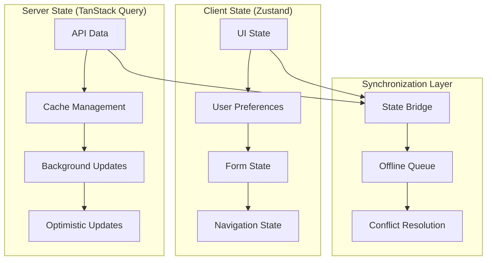

# State Management Architecture Guide

This document provides comprehensive guidance on state management patterns using TanStack Query + Zustand in the EdTech platform.

## Table of Contents

1. [Architecture Overview](#architecture-overview)
2. [TanStack Query for Server State](#tanstack-query-for-server-state)
3. [Zustand for Client State](#zustand-for-client-state)
4. [State Synchronization](#state-synchronization)
5. [Offline State Management](#offline-state-management)
6. [Performance Optimization](#performance-optimization)
7. [Testing Strategies](#testing-strategies)
8. [Best Practices](#best-practices)

## Architecture Overview

Our state management follows a clear separation of concerns:



### State Categories

| State Type       | Tool            | Examples                   | Persistence   |
| ---------------- | --------------- | -------------------------- | ------------- |
| Server Data      | TanStack Query  | Stories, Users, Progress   | Cache only    |
| UI State         | Zustand         | Modals, Filters, Selection | Session/Local |
| User Preferences | Zustand         | Theme, Language, Settings  | Local Storage |
| Form State       | React Hook Form | Create/Edit Forms          | None          |
| Navigation       | Next.js Router  | Current page, params       | URL           |

## TanStack Query for Server State

### Query Key Factory Pattern

Organize query keys hierarchically for efficient cache management:

```typescript
// Query key factory
export const queryKeys = {
  // Stories
  stories: {
    all: ["stories"] as const,
    lists: () => [...queryKeys.stories.all, "list"] as const,
    list: (filters: StoryFilters) =>
      [...queryKeys.stories.lists(), filters] as const,
    details: () => [...queryKeys.stories.all, "detail"] as const,
    detail: (id: string) => [...queryKeys.stories.details(), id] as const,
    chunks: (id: string) =>
      [...queryKeys.stories.detail(id), "chunks"] as const,
  },

  // Learning
  learning: {
    all: ["learning"] as const,
    progress: () => [...queryKeys.learning.all, "progress"] as const,
    userProgress: (userId: string) =>
      [...queryKeys.learning.progress(), userId] as const,
    sessions: () => [...queryKeys.learning.all, "sessions"] as const,
    userSessions: (userId: string) =>
      [...queryKeys.learning.sessions(), userId] as const,
  },

  // Users
  users: {
    all: ["users"] as const,
    lists: () => [...queryKeys.users.all, "list"] as const,
    list: (filters: UserFilters) =>
      [...queryKeys.users.lists(), filters] as const,
    details: () => [...queryKeys.users.all, "detail"] as const,
    detail: (id: string) => [...queryKeys.users.details(), id] as const,
    me: () => [...queryKeys.users.all, "me"] as const,
  },
} as const;
```

### Custom Query Hooks

Create reusable hooks for common data fetching patterns:

```typescript
// Stories hooks
export function useStories(filters: StoryFilters = {}) {
  return useQuery({
    queryKey: queryKeys.stories.list(filters),
    queryFn: () => api<Story[]>(`/api/stories?${new URLSearchParams(filters)}`),
    staleTime: 5 * 60 * 1000, // 5 minutes
    gcTime: 10 * 60 * 1000, // 10 minutes (formerly cacheTime)
  });
}

export function useStory(id: string) {
  return useQuery({
    queryKey: queryKeys.stories.detail(id),
    queryFn: () => api<Story>(`/api/stories/${id}`),
    enabled: !!id,
    staleTime: 10 * 60 * 1000, // 10 minutes
  });
}

export function useStoryChunks(storyId: string) {
  return useQuery({
    queryKey: queryKeys.stories.chunks(storyId),
    queryFn: () => api<StoryChunk[]>(`/api/stories/${storyId}/chunks`),
    enabled: !!storyId,
    staleTime: 15 * 60 * 1000, // 15 minutes (chunks rarely change)
  });
}

// Infinite query for pagination
export function useInfiniteStories(filters: StoryFilters = {}) {
  return useInfiniteQuery({
    queryKey: queryKeys.stories.list(filters),
    queryFn: ({ pageParam = 1 }) =>
      api<PaginatedResponse<Story>>(
        `/api/stories?page=${pageParam}&${new URLSearchParams(filters)}`
      ),
    initialPageParam: 1,
    getNextPageParam: (lastPage) =>
      lastPage.meta.pagination.page < lastPage.meta.pagination.totalPages
        ? lastPage.meta.pagination.page + 1
        : undefined,
    staleTime: 5 * 60 * 1000,
  });
}
```

### Mutation Patterns

Implement mutations with optimistic updates and proper error handling:

```typescript
// Create story mutation
export function useCreateStory() {
  const queryClient = useQueryClient();

  return useMutation({
    mutationFn: (data: CreateStoryData) =>
      api<Story>("/api/stories", {
        method: "POST",
        body: JSON.stringify(data),
      }),

    // Optimistic update
    onMutate: async (newStory) => {
      // Cancel outgoing refetches
      await queryClient.cancelQueries({ queryKey: queryKeys.stories.lists() });

      // Snapshot previous value
      const previousStories = queryClient.getQueryData(
        queryKeys.stories.lists()
      );

      // Optimistically update all story lists
      queryClient.setQueriesData(
        { queryKey: queryKeys.stories.lists() },
        (old: Story[] | undefined) => {
          if (!old)
            return [{ ...newStory, id: "temp-id", createdAt: new Date() }];
          return [
            { ...newStory, id: "temp-id", createdAt: new Date() },
            ...old,
          ];
        }
      );

      return { previousStories };
    },

    // Rollback on error
    onError: (err, newStory, context) => {
      if (context?.previousStories) {
        queryClient.setQueriesData(
          { queryKey: queryKeys.stories.lists() },
          context.previousStories
        );
      }
    },

    // Refetch on success or error
    onSettled: () => {
      queryClient.invalidateQueries({ queryKey: queryKeys.stories.lists() });
    },
  });
}

// Update story mutation
export function useUpdateStory() {
  const queryClient = useQueryClient();

  return useMutation({
    mutationFn: ({ id, data }: { id: string; data: UpdateStoryData }) =>
      api<Story>(`/api/stories/${id}`, {
        method: "PUT",
        body: JSON.stringify(data),
      }),

    onSuccess: (updatedStory) => {
      // Update specific story in cache
      queryClient.setQueryData(
        queryKeys.stories.detail(updatedStory.id),
        updatedStory
      );

      // Update story in all lists
      queryClient.setQueriesData(
        { queryKey: queryKeys.stories.lists() },
        (old: Story[] | undefined) => {
          if (!old) return old;
          return old.map((story) =>
            story.id === updatedStory.id ? updatedStory : story
          );
        }
      );
    },
  });
}

// Delete story mutation
export function useDeleteStory() {
  const queryClient = useQueryClient();

  return useMutation({
    mutationFn: (id: string) => api(`/api/stories/${id}`, { method: "DELETE" }),

    onSuccess: (_, deletedId) => {
      // Remove from cache
      queryClient.removeQueries({
        queryKey: queryKeys.stories.detail(deletedId),
      });

      // Remove from all lists
      queryClient.setQueriesData(
        { queryKey: queryKeys.stories.lists() },
        (old: Story[] | undefined) => {
          if (!old) return old;
          return old.filter((story) => story.id !== deletedId);
        }
      );
    },
  });
}
```

### Background Data Fetching

Implement prefetching and background updates:

```typescript
// Prefetch related data
export function usePrefetchStoryDetails() {
  const queryClient = useQueryClient();

  return useCallback(
    (storyId: string) => {
      queryClient.prefetchQuery({
        queryKey: queryKeys.stories.detail(storyId),
        queryFn: () => api<Story>(`/api/stories/${storyId}`),
        staleTime: 10 * 60 * 1000,
      });
    },
    [queryClient]
  );
}

// Background refetch on window focus
export function useBackgroundRefetch() {
  const queryClient = useQueryClient();

  useEffect(() => {
    const handleFocus = () => {
      queryClient.refetchQueries({
        queryKey: queryKeys.learning.progress(),
        type: "active",
      });
    };

    window.addEventListener("focus", handleFocus);
    return () => window.removeEventListener("focus", handleFocus);
  }, [queryClient]);
}
```

## Zustand for Client State

### Store Factory Pattern

Use our custom store factory for consistent store creation:

```typescript
// Learning UI state
interface LearningUIState {
  // Audio player state
  isPlaying: boolean;
  currentTime: number;
  duration: number;
  playbackSpeed: number;

  // Story reader state
  currentChunkIndex: number;
  highlightedWords: string[];
  showTranslations: boolean;

  // Panel visibility
  showVocabularyPanel: boolean;
  showProgressPanel: boolean;
  showSettingsPanel: boolean;

  // User preferences (persisted)
  autoAdvance: boolean;
  embeddingRatio: number;
  preferredVoice: string;

  // Actions
  setAudioState: (state: Partial<AudioState>) => void;
  setCurrentChunk: (index: number) => void;
  togglePanel: (panel: PanelType) => void;
  updatePreferences: (prefs: Partial<UserPreferences>) => void;
  reset: () => void;
}

export const useLearningUI = makeStore<LearningUIState>(
  (set, get) => ({
    // Initial state
    isPlaying: false,
    currentTime: 0,
    duration: 0,
    playbackSpeed: 1.0,
    currentChunkIndex: 0,
    highlightedWords: [],
    showTranslations: false,
    showVocabularyPanel: false,
    showProgressPanel: true,
    showSettingsPanel: false,
    autoAdvance: true,
    embeddingRatio: 0.2,
    preferredVoice: "default",

    // Actions
    setAudioState: (audioState) =>
      set((state) => ({ ...state, ...audioState })),

    setCurrentChunk: (index) => {
      set({ currentChunkIndex: index });

      // Auto-advance logic
      const { autoAdvance, duration, currentTime } = get();
      if (autoAdvance && currentTime >= duration * 0.95) {
        // Auto-advance to next chunk when current audio is almost finished
        setTimeout(() => {
          const currentIndex = get().currentChunkIndex;
          set({ currentChunkIndex: currentIndex + 1 });
        }, 1000);
      }
    },

    togglePanel: (panel) =>
      set((state) => ({
        [`show${panel}Panel`]:
          !state[`show${panel}Panel` as keyof LearningUIState],
      })),

    updatePreferences: (prefs) => set((state) => ({ ...state, ...prefs })),

    reset: () =>
      set({
        isPlaying: false,
        currentTime: 0,
        currentChunkIndex: 0,
        highlightedWords: [],
        showVocabularyPanel: false,
        showSettingsPanel: false,
      }),
  }),
  {
    name: "learning-ui",
    persist: true,
    partialize: (state) => ({
      // Only persist user preferences
      autoAdvance: state.autoAdvance,
      embeddingRatio: state.embeddingRatio,
      preferredVoice: state.preferredVoice,
      playbackSpeed: state.playbackSpeed,
    }),
  }
);
```

### Selector Patterns

Create efficient selectors to prevent unnecessary re-renders:

```typescript
// Granular selectors
export const useAudioState = () =>
  useLearningUI(
    (state) => ({
      isPlaying: state.isPlaying,
      currentTime: state.currentTime,
      duration: state.duration,
      playbackSpeed: state.playbackSpeed,
    }),
    shallow
  );

export const useStoryReaderState = () =>
  useLearningUI(
    (state) => ({
      currentChunkIndex: state.currentChunkIndex,
      highlightedWords: state.highlightedWords,
      showTranslations: state.showTranslations,
    }),
    shallow
  );

export const usePanelVisibility = () =>
  useLearningUI(
    (state) => ({
      showVocabularyPanel: state.showVocabularyPanel,
      showProgressPanel: state.showProgressPanel,
      showSettingsPanel: state.showSettingsPanel,
    }),
    shallow
  );

// Action selectors
export const useAudioActions = () =>
  useLearningUI(
    (state) => ({
      setAudioState: state.setAudioState,
    }),
    shallow
  );

export const useStoryActions = () =>
  useLearningUI(
    (state) => ({
      setCurrentChunk: state.setCurrentChunk,
      togglePanel: state.togglePanel,
    }),
    shallow
  );

// Computed selectors
export const useCurrentChunk = (chunks: StoryChunk[]) => {
  const currentChunkIndex = useLearningUI((state) => state.currentChunkIndex);
  return useMemo(() => chunks[currentChunkIndex], [chunks, currentChunkIndex]);
};

export const useProgressPercentage = (totalChunks: number) => {
  const currentChunkIndex = useLearningUI((state) => state.currentChunkIndex);
  return useMemo(
    () => (totalChunks > 0 ? (currentChunkIndex / totalChunks) * 100 : 0),
    [currentChunkIndex, totalChunks]
  );
};
```

### Store Composition

Compose multiple stores for complex features:

```typescript
// Vocabulary learning state
interface VocabularyState {
  learnedWords: Set<string>;
  reviewWords: Set<string>;
  difficultWords: Set<string>;

  markAsLearned: (word: string) => void;
  markForReview: (word: string) => void;
  markAsDifficult: (word: string) => void;
  getWordStatus: (word: string) => WordStatus;
}

export const useVocabulary = makeStore<VocabularyState>(
  (set, get) => ({
    learnedWords: new Set(),
    reviewWords: new Set(),
    difficultWords: new Set(),

    markAsLearned: (word) =>
      set((state) => ({
        learnedWords: new Set([...state.learnedWords, word]),
        reviewWords: new Set([...state.reviewWords].filter((w) => w !== word)),
      })),

    markForReview: (word) =>
      set((state) => ({
        reviewWords: new Set([...state.reviewWords, word]),
      })),

    markAsDifficult: (word) =>
      set((state) => ({
        difficultWords: new Set([...state.difficultWords, word]),
      })),

    getWordStatus: (word) => {
      const { learnedWords, reviewWords, difficultWords } = get();
      if (learnedWords.has(word)) return "learned";
      if (reviewWords.has(word)) return "review";
      if (difficultWords.has(word)) return "difficult";
      return "new";
    },
  }),
  {
    name: "vocabulary",
    persist: true,
    partialize: (state) => ({
      learnedWords: Array.from(state.learnedWords),
      reviewWords: Array.from(state.reviewWords),
      difficultWords: Array.from(state.difficultWords),
    }),
    // Custom serialization for Sets
    serialize: (state) =>
      JSON.stringify({
        ...state,
        learnedWords: Array.from(state.learnedWords),
        reviewWords: Array.from(state.reviewWords),
        difficultWords: Array.from(state.difficultWords),
      }),
    deserialize: (str) => {
      const parsed = JSON.parse(str);
      return {
        ...parsed,
        learnedWords: new Set(parsed.learnedWords),
        reviewWords: new Set(parsed.reviewWords),
        difficultWords: new Set(parsed.difficultWords),
      };
    },
  }
);

// Combined hook for learning session
export function useLearningSession(storyId: string) {
  const learningUI = useLearningUI();
  const vocabulary = useVocabulary();
  const { data: story } = useStory(storyId);
  const { data: progress } = useUserProgress(storyId);

  return {
    // UI state
    ...learningUI,

    // Vocabulary state
    vocabulary,

    // Server state
    story,
    progress,

    // Computed values
    currentChunk: story?.chunks?.[learningUI.currentChunkIndex],
    progressPercentage: story?.chunks
      ? (learningUI.currentChunkIndex / story.chunks.length) * 100
      : 0,
  };
}
```

## State Synchronization

### Server-Client Sync

Synchronize server data with client preferences:

```typescript
// Sync user preferences from server to client
export function useSyncUserPreferences() {
  const { data: serverPreferences } = useUserPreferences();
  const updateLocalPreferences = useLearningUI(
    (state) => state.updatePreferences
  );

  useEffect(() => {
    if (serverPreferences) {
      updateLocalPreferences({
        autoAdvance: serverPreferences.learning.autoAdvance,
        embeddingRatio: serverPreferences.learning.embeddingRatio,
        preferredVoice: serverPreferences.learning.preferredVoice,
        playbackSpeed: serverPreferences.learning.playbackSpeed,
      });
    }
  }, [serverPreferences, updateLocalPreferences]);
}

// Debounced sync from client to server
export function useAutoSavePreferences() {
  const preferences = useLearningUI((state) => ({
    autoAdvance: state.autoAdvance,
    embeddingRatio: state.embeddingRatio,
    preferredVoice: state.preferredVoice,
    playbackSpeed: state.playbackSpeed,
  }));

  const { mutate: savePreferences } = useSaveUserPreferences();

  const debouncedSave = useMemo(
    () =>
      debounce((prefs: UserPreferences) => {
        savePreferences({ learning: prefs });
      }, 2000),
    [savePreferences]
  );

  useEffect(() => {
    debouncedSave(preferences);
  }, [preferences, debouncedSave]);
}
```

### Cross-Tab Synchronization

Synchronize state across browser tabs:

```typescript
// Cross-tab state synchronization
export function useCrossTabSync() {
  const learningUI = useLearningUI();

  useEffect(() => {
    const handleStorageChange = (e: StorageEvent) => {
      if (e.key === "learning-ui" && e.newValue) {
        try {
          const newState = JSON.parse(e.newValue);
          learningUI.updatePreferences(newState);
        } catch (error) {
          console.error("Failed to sync cross-tab state:", error);
        }
      }
    };

    window.addEventListener("storage", handleStorageChange);
    return () => window.removeEventListener("storage", handleStorageChange);
  }, [learningUI]);
}

// Broadcast state changes to other tabs
export function useBroadcastStateChanges() {
  const preferences = useLearningUI((state) => ({
    autoAdvance: state.autoAdvance,
    embeddingRatio: state.embeddingRatio,
    preferredVoice: state.preferredVoice,
  }));

  useEffect(() => {
    const channel = new BroadcastChannel("learning-preferences");
    channel.postMessage(preferences);

    return () => channel.close();
  }, [preferences]);
}
```

## Offline State Management

### Offline Queue Pattern

Manage offline actions with a queue system:

```typescript
interface OfflineAction {
  id: string;
  type: string;
  payload: any;
  timestamp: number;
  retries: number;
  maxRetries: number;
}

interface OfflineQueueState {
  isOnline: boolean;
  pendingActions: OfflineAction[];

  addAction: (
    action: Omit<OfflineAction, "id" | "timestamp" | "retries">
  ) => void;
  removeAction: (id: string) => void;
  processQueue: () => Promise<void>;
  setOnlineStatus: (isOnline: boolean) => void;
}

export const useOfflineQueue = makeStore<OfflineQueueState>(
  (set, get) => ({
    isOnline: typeof navigator !== "undefined" ? navigator.onLine : true,
    pendingActions: [],

    addAction: (action) => {
      const newAction: OfflineAction = {
        ...action,
        id: crypto.randomUUID(),
        timestamp: Date.now(),
        retries: 0,
      };

      set((state) => ({
        pendingActions: [...state.pendingActions, newAction],
      }));
    },

    removeAction: (id) =>
      set((state) => ({
        pendingActions: state.pendingActions.filter(
          (action) => action.id !== id
        ),
      })),

    processQueue: async () => {
      const { pendingActions, isOnline } = get();

      if (!isOnline || pendingActions.length === 0) return;

      for (const action of pendingActions) {
        try {
          await processOfflineAction(action);
          get().removeAction(action.id);
        } catch (error) {
          console.error("Failed to process offline action:", error);

          // Increment retry count
          set((state) => ({
            pendingActions: state.pendingActions.map((a) =>
              a.id === action.id ? { ...a, retries: a.retries + 1 } : a
            ),
          }));

          // Remove if max retries reached
          if (action.retries >= action.maxRetries) {
            get().removeAction(action.id);
          }
        }
      }
    },

    setOnlineStatus: (isOnline) => {
      set({ isOnline });
      if (isOnline) {
        get().processQueue();
      }
    },
  }),
  {
    name: "offline-queue",
    persist: true,
  }
);

// Process different types of offline actions
async function processOfflineAction(action: OfflineAction): Promise<void> {
  switch (action.type) {
    case "UPDATE_PROGRESS":
      await api("/api/learning/progress", {
        method: "POST",
        body: JSON.stringify(action.payload),
      });
      break;

    case "SAVE_VOCABULARY":
      await api("/api/vocabulary/progress", {
        method: "POST",
        body: JSON.stringify(action.payload),
      });
      break;

    case "SUBMIT_EXERCISE":
      await api("/api/exercises/submit", {
        method: "POST",
        body: JSON.stringify(action.payload),
      });
      break;

    default:
      throw new Error(`Unknown action type: ${action.type}`);
  }
}

// Hook to handle online/offline status
export function useOnlineStatus() {
  const { isOnline, setOnlineStatus, processQueue } = useOfflineQueue();

  useEffect(() => {
    const handleOnline = () => {
      setOnlineStatus(true);
      processQueue();
    };

    const handleOffline = () => {
      setOnlineStatus(false);
    };

    window.addEventListener("online", handleOnline);
    window.addEventListener("offline", handleOffline);

    return () => {
      window.removeEventListener("online", handleOnline);
      window.removeEventListener("offline", handleOffline);
    };
  }, [setOnlineStatus, processQueue]);

  return isOnline;
}
```

### Optimistic Updates with Rollback

Handle optimistic updates that can be rolled back when offline:

```typescript
// Optimistic progress update
export function useOptimisticProgressUpdate() {
  const queryClient = useQueryClient();
  const { addAction } = useOfflineQueue();
  const isOnline = useOnlineStatus();

  return useMutation({
    mutationFn: async (progressData: ProgressUpdate) => {
      if (isOnline) {
        return api("/api/learning/progress", {
          method: "POST",
          body: JSON.stringify(progressData),
        });
      } else {
        // Add to offline queue
        addAction({
          type: "UPDATE_PROGRESS",
          payload: progressData,
          maxRetries: 3,
        });

        // Return optimistic response
        return { ...progressData, id: "temp-id" };
      }
    },

    onMutate: async (progressData) => {
      // Cancel outgoing refetches
      await queryClient.cancelQueries({
        queryKey: queryKeys.learning.userProgress(progressData.userId),
      });

      // Snapshot previous value
      const previousProgress = queryClient.getQueryData(
        queryKeys.learning.userProgress(progressData.userId)
      );

      // Optimistically update
      queryClient.setQueryData(
        queryKeys.learning.userProgress(progressData.userId),
        (old: ProgressData | undefined) => ({
          ...old,
          ...progressData,
          updatedAt: new Date().toISOString(),
        })
      );

      return { previousProgress };
    },

    onError: (err, progressData, context) => {
      // Rollback on error
      if (context?.previousProgress) {
        queryClient.setQueryData(
          queryKeys.learning.userProgress(progressData.userId),
          context.previousProgress
        );
      }
    },
  });
}
```

## Performance Optimization

### Selective Re-rendering

Use shallow comparison and granular selectors:

```typescript
// ❌ Bad: Will re-render on any state change
const learningState = useLearningUI();

// ✅ Good: Only re-renders when audio state changes
const audioState = useLearningUI(
  (state) => ({
    isPlaying: state.isPlaying,
    currentTime: state.currentTime,
    duration: state.duration,
  }),
  shallow
);

// ✅ Better: Use specific selectors
const isPlaying = useLearningUI((state) => state.isPlaying);
const currentTime = useLearningUI((state) => state.currentTime);
```

### Memoization Patterns

Memoize expensive computations:

```typescript
// Memoized computed values
export function useComputedLearningStats(userId: string) {
  const { data: sessions } = useLearningSessions(userId);
  const { data: progress } = useUserProgress(userId);

  return useMemo(() => {
    if (!sessions || !progress) return null;

    return {
      totalTimeSpent: sessions.reduce(
        (sum, session) => sum + session.timeSpentSec,
        0
      ),
      averageSessionTime:
        sessions.length > 0
          ? sessions.reduce((sum, session) => sum + session.timeSpentSec, 0) /
            sessions.length
          : 0,
      completionRate:
        progress.filter((p) => p.status === "completed").length /
        progress.length,
      streakDays: calculateStreakDays(sessions),
    };
  }, [sessions, progress]);
}

// Memoized selectors
export const useOptimizedStoryData = (storyId: string) => {
  const { data: story } = useStory(storyId);
  const { data: chunks } = useStoryChunks(storyId);

  return useMemo(() => {
    if (!story || !chunks) return null;

    return {
      ...story,
      chunks: chunks.sort((a, b) => a.chunkOrder - b.chunkOrder),
      embeddedWordCount: chunks.reduce(
        (count, chunk) =>
          count +
          (chunk.type === "chem" ? countEmbeddedWords(chunk.chunkText) : 0),
        0
      ),
      estimatedReadingTime: calculateReadingTime(chunks),
    };
  }, [story, chunks]);
};
```

### Query Optimization

Optimize TanStack Query performance:

```typescript
// Batch related queries
export function useLearningSessionData(sessionId: string) {
  const queries = useQueries({
    queries: [
      {
        queryKey: queryKeys.learning.sessions.detail(sessionId),
        queryFn: () =>
          api<LearningSession>(`/api/learning/sessions/${sessionId}`),
      },
      {
        queryKey: queryKeys.stories.detail(sessionId),
        queryFn: () => api<Story>(`/api/stories/${sessionId}`),
        enabled: !!sessionId,
      },
      {
        queryKey: queryKeys.learning.userProgress(sessionId),
        queryFn: () => api<ProgressData>(`/api/learning/progress/${sessionId}`),
        enabled: !!sessionId,
      },
    ],
  });

  return {
    session: queries[0].data,
    story: queries[1].data,
    progress: queries[2].data,
    isLoading: queries.some((q) => q.isLoading),
    error: queries.find((q) => q.error)?.error,
  };
}

// Parallel data fetching
export function usePrefetchLearningData(userId: string) {
  const queryClient = useQueryClient();

  useEffect(() => {
    // Prefetch related data in parallel
    Promise.all([
      queryClient.prefetchQuery({
        queryKey: queryKeys.learning.userProgress(userId),
        queryFn: () => api(`/api/learning/progress/user/${userId}`),
      }),
      queryClient.prefetchQuery({
        queryKey: queryKeys.learning.userSessions(userId),
        queryFn: () => api(`/api/learning/sessions/user/${userId}`),
      }),
      queryClient.prefetchQuery({
        queryKey: queryKeys.users.detail(userId),
        queryFn: () => api(`/api/users/${userId}`),
      }),
    ]);
  }, [userId, queryClient]);
}
```

## Testing Strategies

### Testing Zustand Stores

```typescript
// Test utilities for Zustand stores
export function createTestStore<T>(initialState?: Partial<T>) {
  return makeStore<T>(
    (set, get) =>
      ({
        ...initialState,
        // Add test-specific methods
        __reset: () => set(initialState as T),
        __getState: () => get(),
      }) as T,
    { name: "test-store", persist: false }
  );
}

// Example test
describe("LearningUI Store", () => {
  let store: ReturnType<typeof useLearningUI>;

  beforeEach(() => {
    store = createTestStore({
      isPlaying: false,
      currentChunkIndex: 0,
      autoAdvance: true,
    });
  });

  it("should update audio state", () => {
    const { setAudioState } = store.getState();

    act(() => {
      setAudioState({ isPlaying: true, currentTime: 30 });
    });

    expect(store.getState().isPlaying).toBe(true);
    expect(store.getState().currentTime).toBe(30);
  });

  it("should auto-advance when enabled", () => {
    const { setCurrentChunk, setAudioState } = store.getState();

    act(() => {
      setAudioState({ duration: 100, currentTime: 95 });
      setCurrentChunk(0);
    });

    // Wait for auto-advance timeout
    act(() => {
      jest.advanceTimersByTime(1100);
    });

    expect(store.getState().currentChunkIndex).toBe(1);
  });
});
```

### Testing TanStack Query

```typescript
// Test utilities for TanStack Query
export function createQueryTestWrapper() {
  const queryClient = new QueryClient({
    defaultOptions: {
      queries: { retry: false },
      mutations: { retry: false },
    },
  });

  return ({ children }: { children: React.ReactNode }) => (
    <QueryClientProvider client={queryClient}>
      {children}
    </QueryClientProvider>
  );
}

// Mock API responses
export function mockApiResponse<T>(data: T, delay = 0) {
  return jest.fn().mockImplementation(() =>
    new Promise(resolve => setTimeout(() => resolve(data), delay))
  );
}

// Example test
describe('useStories hook', () => {
  it('should fetch stories successfully', async () => {
    const mockStories = [
      { id: '1', title: 'Test Story 1' },
      { id: '2', title: 'Test Story 2' },
    ];

    (api as jest.Mock).mockResolvedValueOnce(mockStories);

    const { result } = renderHook(() => useStories(), {
      wrapper: createQueryTestWrapper(),
    });

    await waitFor(() => {
      expect(result.current.isSuccess).toBe(true);
    });

    expect(result.current.data).toEqual(mockStories);
  });

  it('should handle optimistic updates', async () => {
    const queryClient = new QueryClient();
    const { result } = renderHook(() => useCreateStory(), {
      wrapper: ({ children }) => (
        <QueryClientProvider client={queryClient}>
          {children}
        </QueryClientProvider>
      ),
    });

    const newStory = { title: 'New Story', content: 'Content' };

    act(() => {
      result.current.mutate(newStory);
    });

    // Check optimistic update
    const cachedData = queryClient.getQueryData(queryKeys.stories.lists());
    expect(cachedData).toContainEqual(
      expect.objectContaining({ title: 'New Story' })
    );
  });
});
```

## Best Practices

### State Organization

1. **Separate Concerns**: Use TanStack Query for server state, Zustand for client state
2. **Granular Stores**: Create focused stores for specific features rather than one large store
3. **Consistent Patterns**: Follow the same patterns across all stores and queries
4. **Type Safety**: Use TypeScript interfaces for all state shapes

### Performance

1. **Selective Subscriptions**: Use shallow comparison and specific selectors
2. **Memoization**: Memoize expensive computations and derived state
3. **Query Optimization**: Use appropriate stale times and cache times
4. **Prefetching**: Prefetch data that users are likely to need

### Error Handling

1. **Graceful Degradation**: Handle errors gracefully with fallback UI
2. **Retry Logic**: Implement appropriate retry strategies for mutations
3. **Offline Support**: Queue actions when offline and process when online
4. **User Feedback**: Provide clear feedback for loading and error states

### Testing

1. **Unit Tests**: Test individual stores and hooks in isolation
2. **Integration Tests**: Test the interaction between stores and queries
3. **Mock Appropriately**: Mock API calls but test real state logic
4. **Test Edge Cases**: Test error conditions and edge cases

This comprehensive guide provides the foundation for effective state management in the EdTech platform, ensuring scalable, maintainable, and performant applications.
